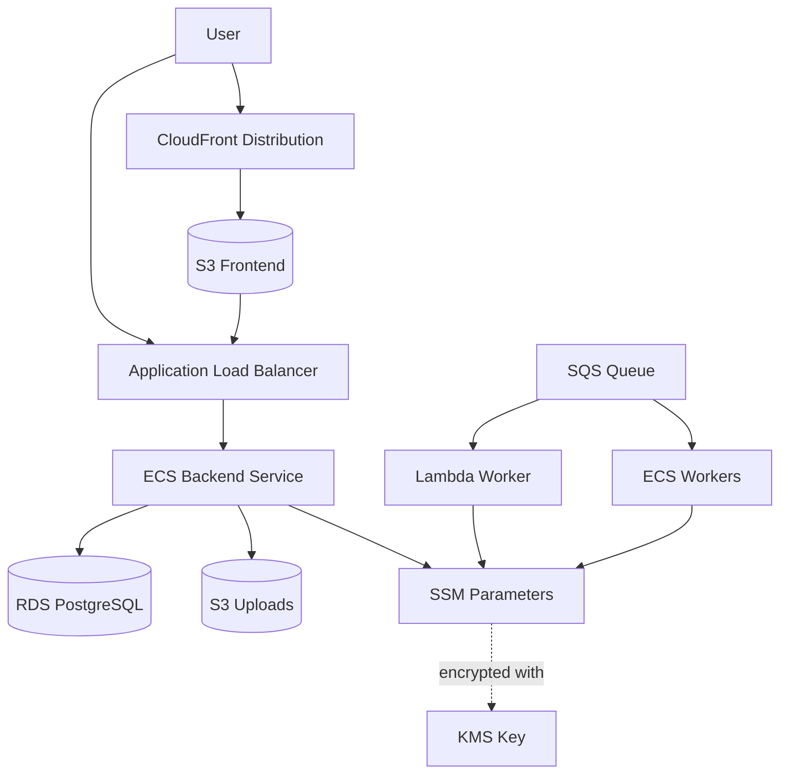

<objective>
Complete infrastructure wiring and create comprehensive documentation.

Purpose: The infrastructure needs documentation for developers and operators. This plan ensures all components are properly wired, outputs are exported, and documentation explains how to use the stack.

Output: Complete Pulumi stack with documentation.
</objective>

<execution_context>
@~/.claude/get-shit-done/workflows/execute-plan.md
@~/.claude/get-shit-done/templates/summary.md
</execution_context>

<context>
@.planning/PROJECT.md
@.planning/ROADMAP.md
@planning/STATE.md
@/home/jussi/Development/viberator/viberator/infrastructure/WORKERS.md
</context>

<tasks>

<task type="auto">
  <name>Task 1: Update main index.ts with all component imports and exports</name>
  <files>infrastructure/index.ts</files>
  <action>
Update `infrastructure/index.ts` to wire all components:

1. Import all components:
   - vpc (from components/vpc)
   - database (from components/database)
   - storage (from components/storage)
   - kms (from components/kms)
   - logging (from components/logging)
   - registry (from components/registry)
   - queue (from components/queue)
   - workerLambda (from components/worker-lambda)
   - workerEcs (from components/worker-ecs)
   - loadBalancer (from components/load-balancer)
   - backendEcs (from components/backend-ecs)
   - frontend (from components/frontend)

2. Create all components with proper config passing
3. Export all stack outputs:
   - VPC: vpcId, publicSubnetIds, privateSubnetIds
   - Database: databaseEndpoint, databasePort, databaseSsmPaths
   - Storage: uploadsBucketName, uploadsBucketArn
   - KMS: kmsKeyId, kmsKeyArn
   - Logging: logGroupNames
   - Registry: repositoryUrl
   - Queue: queueUrl, queueArn
   - Lambda: lambdaArn, lambdaName
   - Worker ECS: clusterArn, taskDefinitionArn
   - Backend: backendUrl, backendServiceArn
   - Frontend: frontendUrl, frontendDistributionId

4. Add environment tags to all resources
5. Ensure proper dependency ordering (components can reference outputs from other components)

Use component exports directly (no need for intermediate exports).
  </action>
  <verify>
    - `cd infrastructure && npx tsc` compiles without errors
    - `pulumi preview --stack dev` shows all resources without circular dependencies
    - All planned resources have appropriate tags
  </verify>
  <done>
    All components imported and wired. No circular dependencies. All outputs exported. Resources consistently tagged.
  </done>
</task>

<task type="auto">
  <name>Task 2: Create comprehensive README documentation</name>
  <files>infrastructure/README.md</files>
  <action>
Create `infrastructure/README.md` with complete documentation:

1. Overview:
   - What infrastructure is provisioned
   - AWS services used
   - Architecture diagram (text-based or mermaid)

2. Prerequisites:
   - Pulumi CLI installed
   - AWS credentials configured
   - Node.js and npm

3. Quick Start:
   - `cd infrastructure`
   - `npm install`
   - `pulumi stack select dev`
   - `pulumi config set aws:region eu-west-1`
   - `pulumi up`

4. Stack Outputs:
   - List all exported outputs
   - Explain what each output provides
   - Example: `databaseEndpoint` - RDS PostgreSQL endpoint

5. Components:
   - VPC: Networking setup
   - Database: RDS PostgreSQL
   - Storage: S3 for uploads
   - KMS: Encryption keys
   - Logging: CloudWatch log groups
   - Registry: ECR for container images
   - Workers: Lambda and ECS infrastructure
   - Backend: ECS Fargate service
   - Frontend: S3+CloudFront hosting

6. Stack Configuration:
   - Available config keys
   - Environment-specific values
   - Example: `pulumi config set dbInstanceClass db.t4g.micro`

7. Deployment:
   - How to build and push container images
   - How to deploy backend/frontend
   - CloudFront invalidation

8. Troubleshooting:
   - Common issues
   - How to view logs
   - How to SSH into containers (ECS Exec)

9. Cost Management:
   - Cost-saving measures by environment
   - Resource cleanup
   - `pulumi destroy`

10. Security Notes:
    - SSM parameter paths
    - KMS key usage
    - Security group rules

Use markdown formatting with code blocks and mermaid diagrams.
  </action>
  <verify>
    - `cat infrastructure/README.md` shows all sections
    - README is at least 100 lines
    - All stack outputs documented
    - Architecture diagram included
  </verify>
  <done>
    Comprehensive README created. All components documented. Stack outputs listed. Quick start guide available. Troubleshooting section included.
  </done>
</task>

<task type="auto">
  <name>Task 3: Add architecture diagram and configuration reference</name>
  <files>infrastructure/README.md, infrastructure/config.ts</files>
<action>
Add to `infrastructure/README.md`:

1. Architecture diagram using mermaid:

2. Configuration reference table:
   | Config Key | Default | Description |
   |------------|---------|-------------|
   | aws:region | eu-west-1 | AWS region |
   | dbInstanceClass | db.t4g.micro | RDS instance size |
   | backendMinTasks | 1 | Min backend tasks |
   | ... | ... | ... |

3. Network diagram:
   - VPC with public/private subnets
   - NAT gateway placement
   - Security group relationships

4. Data flow diagram:
   - Request flow from user to backend
   - Worker execution flow
   - File upload flow

5. Update `infrastructure/config.ts` with typed config interface if not already present

Use mermaid diagrams in markdown for visual reference.
  </action>
  <verify>
    - README contains mermaid diagrams
    - Configuration reference table complete
    - Network diagram shows subnets, NAT, security groups
    - Data flow diagrams documented
  </verify>
  <done>
    Architecture diagrams in README. Configuration reference table complete. Network and data flow diagrams added. Visual representation of infrastructure.
  </done>
</task>

<task type="auto">
  <name>Task 4: Verify and finalize all stack configurations</name>
  <files>Pulumi.dev.yaml, Pulumi.staging.yaml, Pulumi.prod.yaml</files>
<action>
Finalize stack configuration files:

1. Review `Pulumi.dev.yaml`:
   - Cost-optimized settings
   - Single NAT gateway
   - Smaller instance classes
   - Shorter log retention
   - No deletion protection on RDS

2. Review `Pulumi.staging.yaml`:
   - Medium capacity
   - Single NAT (optional)
   - Moderate log retention
   - No deletion protection

3. Review `Pulumi.prod.yaml`:
   - High availability (multi-AZ, multi-NAT)
   - Larger instance classes
   - Longer log retention
   - Deletion protection enabled
   - Enhanced monitoring

4. Ensure all config keys have descriptions:
   - Use `#` comments in YAML
   - Document valid values
   - Link to AWS documentation where relevant

5. Create `Pulumi.yaml` (main) with:
   - Project description
   - Runtime: nodejs
   - Template references (if using)

6. Test `pulumi config` for each stack to verify all keys are set
  </action>
  <verify>
    - `pulumi config --stack dev` shows all config keys
    - `pulumi config --stack prod` shows production-appropriate values
    - Each stack config has comments explaining keys
    - `pulumi preview --stack dev` and `--stack prod` both succeed
  </verify>
  <done>
    All three stacks configured appropriately. Config keys documented. Preview succeeds for all environments. Cost optimizations applied to dev.
  </done>
</task>

</tasks>

<verification>
1. `infrastructure/index.ts` imports and wires all components
2. `pulumi preview --stack dev` shows all resources without errors
3. `infrastructure/README.md` is comprehensive (100+ lines)
4. Architecture diagrams included (mermaid)
5. Configuration reference table complete
6. All stack outputs documented
</verification>

<success_criteria>
- Complete infrastructure stack wired together
- Comprehensive README with architecture diagrams
- Configuration reference for all stack settings
- Quick start guide for deployment
- Troubleshooting section
- All stack outputs documented and exported
</success_criteria>

<output>
After completion, create `.planning/phases/10-aws-infrastructure/10-09-SUMMARY.md`
</output>
