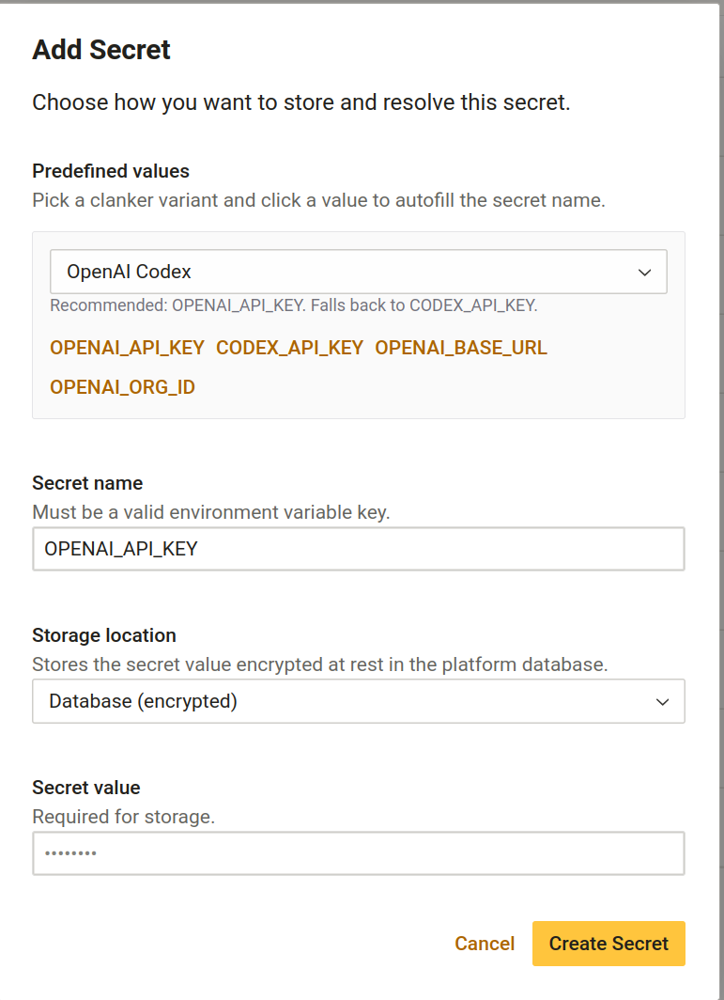
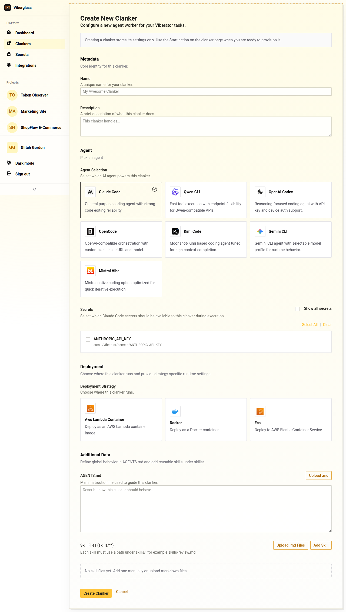
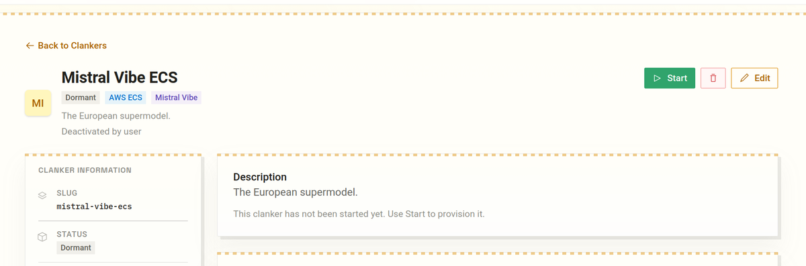
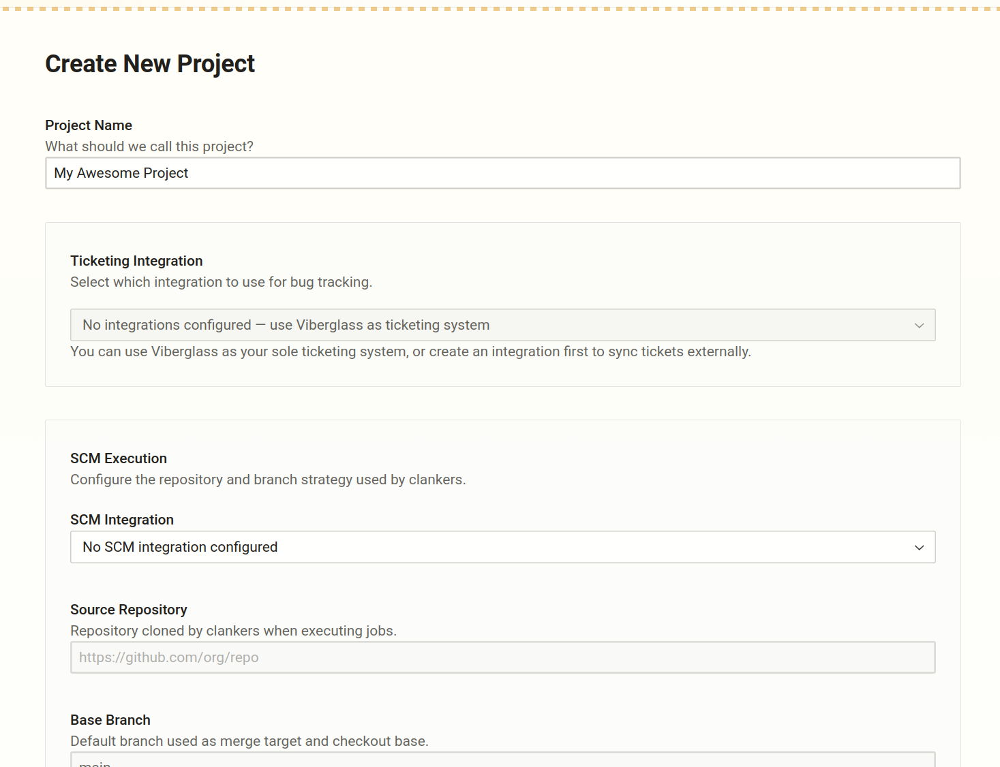
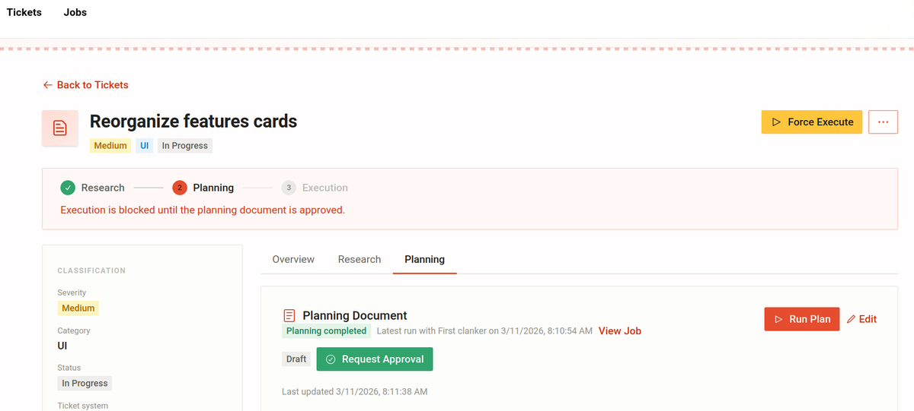

# Viberglass

Viberglass is an open-source agent orchestrator and ticket management platform. Team members create tickets describing bugs or code changes, and AI agents automatically research the codebase, write the fix, and open a pull request for review.

No repository access required to file a ticket. QA engineers, PMs, and customer success teams can submit issues directly. Developers review the PR when it's ready.

## How it works

1. Someone creates a ticket (via the UI, GitHub webhook, Shortcut, Jira, etc.)
2. The platform dispatches a job to a configured agent worker target (**Clanker**)
3. A **viberator** starts from that Clanker configuration
4. The viberator clones the repo, analyzes the code, and pushes a fix
5. A pull request lands in your repository for standard review

A **Clanker** is the saved configuration for how an agent should run: which AI model, what compute (Docker, Lambda, ECS Fargate), and which credentials to use.

A **viberator** is the running instantiation of a Clanker. You can run multiple viberators from different Clankers side by side.

## Supported agent harnesses

Claude Code, OpenAI Codex, Gemini CLI, Qwen CLI, Mistral Vibe, OpenCode, Kimi Code

## Integrations

**Ticket sources:** GitHub Issues, Shortcut, custom webhooks...

**Compute:** Docker (local or self-hosted), AWS Lambda, AWS ECS Fargate

---

## Quick start

Requires Docker Engine 20.10+ and Docker Compose v2.

```bash
git clone https://github.com/ilities/viberglass.git
cd viberglass
docker compose up
```

The platform is available at http://localhost:3000. The backend API runs on port 8888.

On first run, the backend runs database migrations automatically. If you need to run them manually:

```bash
docker compose exec backend npm run migrate:latest
```

---

## Running agents

To be able to start getting your tickets fixed, you need to set up a Clanker, a project and configure credentials for your agent harness.

**Step 1: Set up your environment secrets**

Viberglass manages your secrets for you either encrypted in the database or in AWS SSM. You can also use local environment variables and refer to them only via the platform UI for local use.

For the first run, you want to set up at least your GitHub token (GITHUB_TOKEN) and an API key for your favourite agent harness (suggested values in the UI)..



**Step 2: Create your Clanker configuration**

To execute tickets, you need at least one Clanker. Clankers are configured and managed entirely through the UI at `/clankers`: pick the compute type, set credentials, and click **Start**. The platform handles provisioning the container, ECS task definition, or Lambda function, then launches a viberator from that configuration.



The simplest local setup uses Docker. AWS Lambda and ECS Clankers are for production use and work better once the whole app is deployed.

**Step 3: Deploy/Build your Clanker**


Via the UI:
Click the **Start** button on your configured Clanker page to configure a viberator image ready to be used. Depending on the compute type, the platform will either build a Docker image, create an ECS task definition, or a Lambda function. For more information on how to build your own Clanker images, see Worker Images section below.


**Step 4: Configure your project**

Once your Clanker is running, you can configure your project to use it. Go to `/projects` and click **Create Project**. Within the project settings page, you can select the integration that you want to link to the project. This allows you to configure your SCM (e.g. GitHub) and ticket source (e.g. Jira) and link them to be used by the project with the correct values like repository URL and ticket labels.



**Step 5: Create tickets and put your viberators to work!**

After you've set up your project, you can create tickets in the UI or via an integration webhook. Once you are happy with the ticket you have created, you can put your Clanker to work to step through the 'Research', 'Plan' and 'Execute' phases of the ticket lifecycle.



---

## Configuration

The backend reads environment variables from `apps/platform-backend/.env`. Copy `.env.example` to get started.

Key variables:

| Variable                                                  | Description                                 |
|-----------------------------------------------------------|---------------------------------------------|
| `DB_HOST`, `DB_PORT`, `DB_NAME`, `DB_USER`, `DB_PASSWORD` | PostgreSQL connection                       |
| `SECRETS_ENCRYPTION_KEY`                                  | Encrypts tenant credentials at rest         |
| `WEBHOOK_SECRET_ENCRYPTION_KEY`                           | Encrypts webhook secrets                    |
| `AUTH_ENABLED`                                            | Set to `false` to disable auth in local dev |
| `PORT`                                                    | Backend port (default: `8888`)              |


Agent API keys go in the worker's environment, not the platform backend. In production, store them in AWS SSM under `/viberglass-viberator/`.

---

## AWS deployment

The `infra/` directory contains three Pulumi stacks that must deploy in order.

**Prerequisites:** Pulumi CLI, AWS credentials, Node.js 20+

```bash
# Set up S3 state backend
./infra/setup-pulumi-state.sh
pulumi login s3://viberglass-pulumi-state

# Deploy base infrastructure (VPC, KMS, logging)
cd infra/base && npm install && pulumi stack select dev && pulumi up

# Deploy platform (ECS backend, RDS, Amplify frontend)
cd infra/platform && npm install && pulumi stack select dev && pulumi up

# Deploy workers (Lambda and ECS execution)
cd infra/workers && npm install && pulumi stack select dev && pulumi up
```

### Worker images

Before creating ECS or Lambda Clankers, the worker images need to be in ECR. The `deploy-viberators` GitHub Actions workflow handles this.

It runs automatically on any push to `main` that touches `apps/viberator/` or `infra/workers/docker/`. You can also trigger it manually from the Actions tab to target a specific environment and harness type:

- **Environment:** `dev` or `prod`
- **Harness:** `multi-agent` (default), `claude`, `codex`, `gemini`, `qwen`, `mistral`, `kimi`, `opencode`, `lambda`, or `all`

To push images manually from the command line:

```bash
# Build and push the default multi-agent harness to dev
./infra/workers/scripts/setup-harness-images.sh dev multi-agent

# Build and push all harness images to prod
./infra/workers/scripts/setup-harness-images.sh prod all
```

The script creates ECR repositories if they don't exist, builds each image, and pushes it. Agent images depend on the base image, so the script builds that first automatically.

### Creating AWS Clankers

Once images are in ECR, go to `/clankers` in the UI, create a Clanker with ECS or Lambda compute, and click **Start**. The platform creates the task definition or Lambda function and wires it up. Network config (subnets, security groups) comes from the Pulumi stack outputs.

Agent credentials in production go in SSM: `/viberator/tenants/{tenantId}/GITHUB_TOKEN` and `/viberator/tenants/{tenantId}/ANTHROPIC_API_KEY`.

### Database migrations

```bash
# Development
npm run migrate -w @viberglass/platform-backend

# Staging / production
./apps/platform-backend/scripts/run-migrations.sh staging
./apps/platform-backend/scripts/run-migrations.sh prod --dry-run
./apps/platform-backend/scripts/run-migrations.sh prod
```

Always test migrations in staging before running in production. Verify an RDS backup exists first.

---

## Testing

```bash
# Unit and integration tests (from repo root)
npm test -w @viberglass/platform-backend

# E2E tests (Playwright)
cd tests/e2e

# Option 1: docker-compose services (fixed ports)
npm run setup:docker

# Option 2: testcontainers (dynamic ports, written to .env.e2e)
npm run setup:services

npm test
```

E2E tests start the frontend and backend automatically via Playwright's webServer config. See `tests/e2e/docker/.env.example` for the expected environment variables.

---

## Managed cloud

If you'd rather not run your own infrastructure, Viberglass is available as a hosted service at [viberglass.io](https://viberglass.io). Plans start at $29/month for 3 seats.

---

## License

[Apache 2.0](LICENSE)
