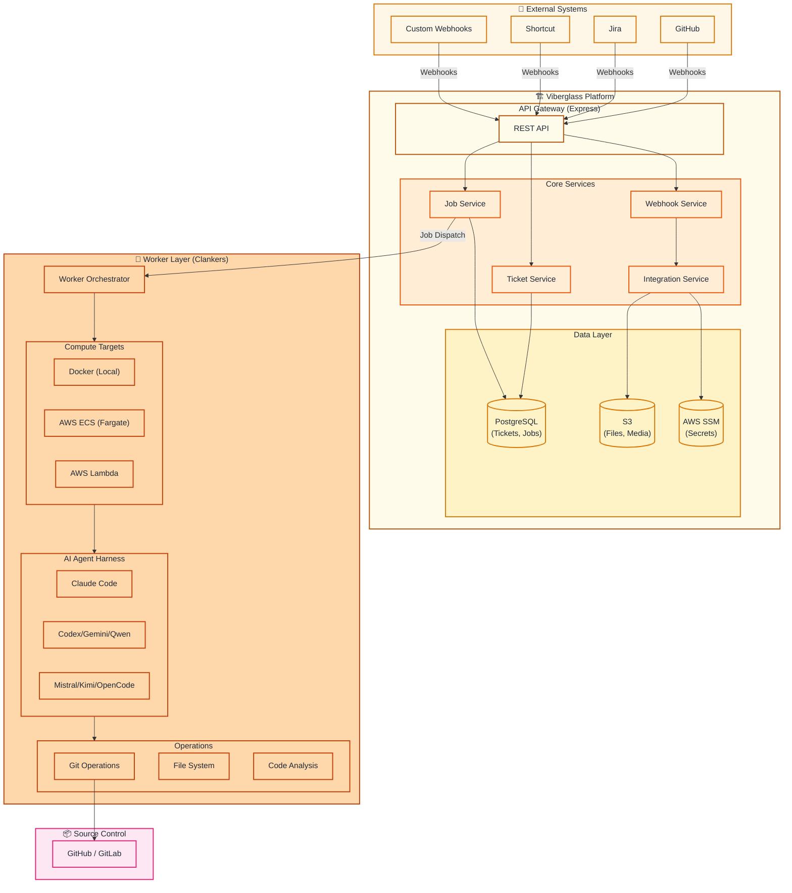
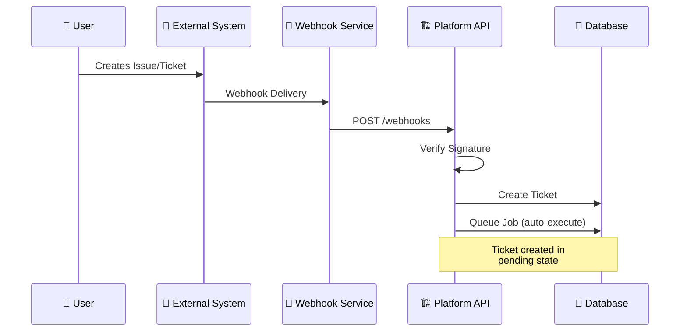
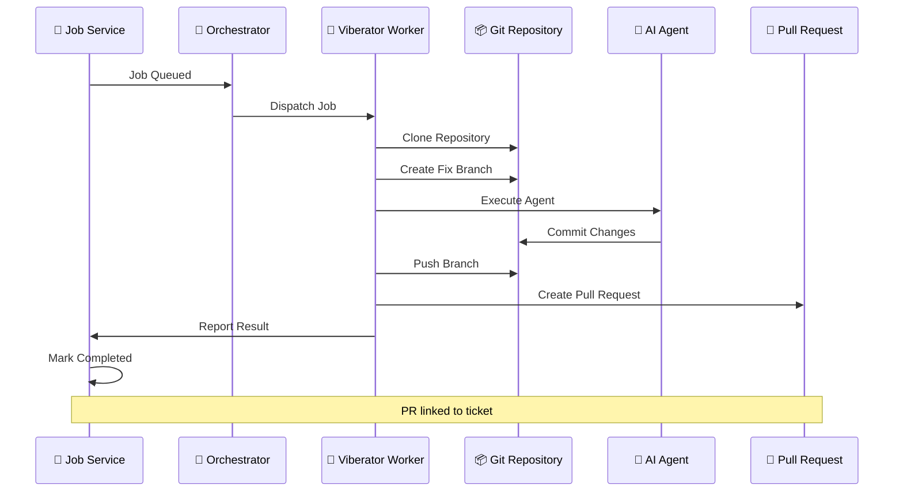
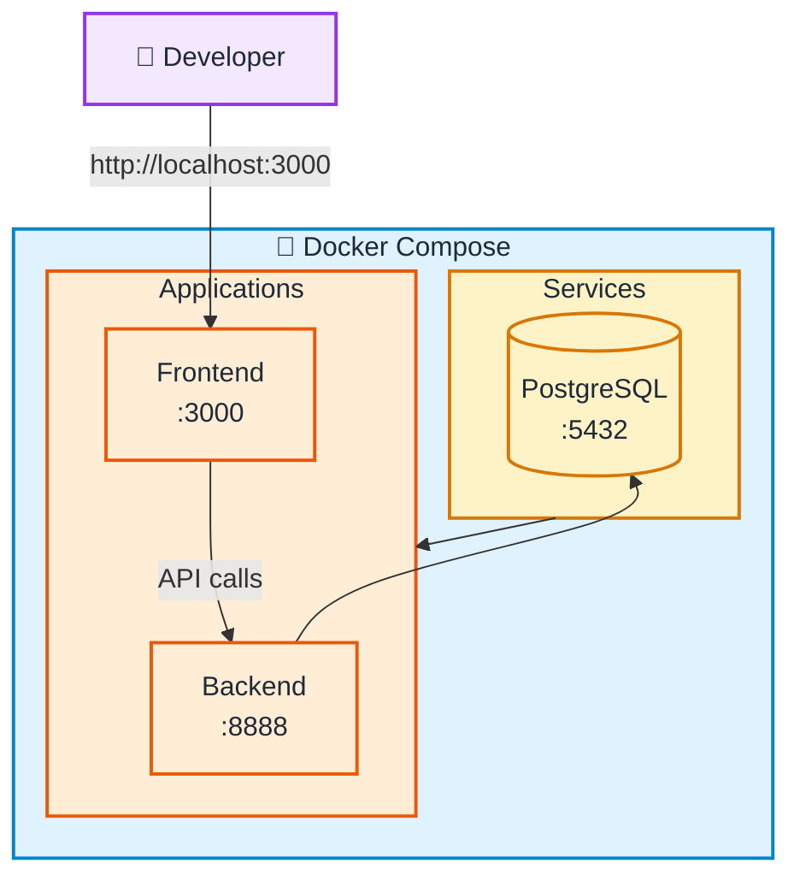
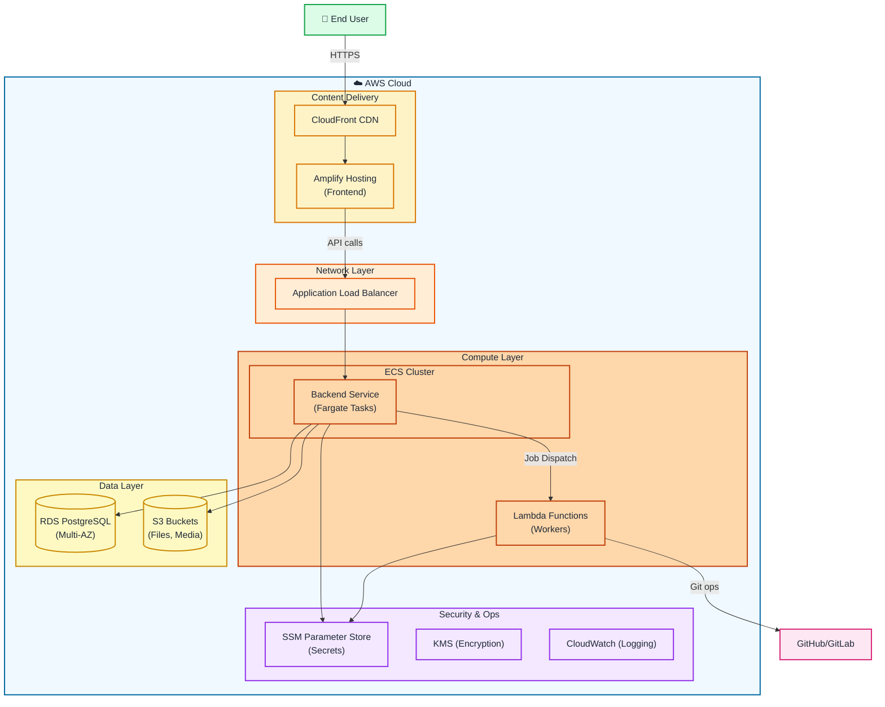

# Viberglass Architecture

This document provides a comprehensive overview of the Viberglass system architecture.

## Table of Contents

- [System Overview](#system-overview)
- [Architecture Diagram](#architecture-diagram)
- [Core Components](#core-components)
- [Data Flow](#data-flow)
- [Technology Stack](#technology-stack)
- [Deployment Architecture](#deployment-architecture)
- [Scalability Considerations](#scalability-considerations)

## System Overview

Viberglass is an AI agent orchestrator and ticket management platform. It automates the process of fixing bugs and implementing code changes by:

1. Receiving tickets from external systems (GitHub, Jira, Shortcut, etc.)
2. Dispatching jobs to AI agent workers (Clankers)
3. Managing the execution lifecycle
4. Posting results back to the originating system

### Key Concepts

- **Ticket**: A work item representing a bug, feature request, or code change
- **Job**: An execution unit that processes a ticket
- **Clanker**: A configured AI agent worker (defines model, compute, credentials)
- **Viberator**: A running instantiation of a Clanker
- **Project**: A collection of tickets, integrations, and configurations
- **Integration**: Connection to external systems (GitHub, Jira, etc.)

## Architecture Diagram

## Core Components

### Platform Backend (`apps/platform-backend`)

Express.js REST API that serves as the central coordination point.

**Responsibilities:**
- RESTful API for ticket, job, and project management
- Webhook ingestion and processing
- Job queue management
- Integration with external systems
- Secret management and encryption

**Key Services:**
- `TicketService`: CRUD operations for tickets
- `JobService`: Job lifecycle management
- `IntegrationService`: External system connectors
- `WebhookService`: Webhook processing and validation
- `SecretService`: Credential encryption/decryption
- `ClankerService`: Worker configuration and management

### Platform Frontend (`apps/platform-frontend`)

React SPA (Vite) for user interaction.

**Responsibilities:**
- Dashboard and project management UI
- Ticket creation and monitoring
- Job execution visualization
- Integration configuration
- Clanker management

**Key Features:**
- Real-time job progress updates
- Interactive ticket forms with media upload
- Integration-specific configuration pages
- Clanker health monitoring

### Viberator Worker (`apps/viberator`)

AI agent execution engine that processes jobs.

**Responsibilities:**
- Repository cloning and branch management
- AI agent harness execution
- Code analysis and modification
- Commit and pull request creation
- Progress reporting to platform

**Supported Agent Harnesses:**
- Claude Code (Anthropic)
- OpenAI Codex
- Gemini CLI (Google)
- Qwen CLI (Alibaba)
- Mistral Vibe
- OpenCode
- Kimi Code

### Infrastructure (`infra/`)

Pulumi-based infrastructure as code.

**Stacks:**
1. **Base**: VPC, KMS, CloudWatch logging
2. **Platform**: ECS, RDS, S3, Amplify
3. **Workers**: Lambda, ECS task definitions

## Data Flow

### Ticket Creation Flow

1. User creates issue in GitHub/Jira/Shortcut
2. Webhook delivered to platform
3. Signature verified, payload validated
4. Ticket created in database
5. If auto-execute enabled, job queued

### Job Execution Flow

1. Job status: `queued`
2. Available Clanker picks up job
3. Worker clones repository
4. AI agent analyzes and modifies code
5. Changes committed and pushed
6. Pull request created
7. Job status: `completed`
8. Result posted back to external system

## Technology Stack

### Backend

| Technology | Purpose |
|------------|---------|
| Node.js 20+ | Runtime |
| Express.js | Web framework |
| TypeScript | Type safety |
| Kysely | Type-safe SQL query builder |
| PostgreSQL | Primary database |
| AWS SSM | Secret storage (production) |
| AWS S3 | File storage |

### Frontend

| Technology | Purpose |
|------------|---------|
| Vite 6 | Build tool and dev server |
| React 19 | UI library |
| TypeScript | Type safety |
| Tailwind CSS | Styling |

### Infrastructure

| Technology | Purpose |
|------------|---------|
| Pulumi | Infrastructure as Code |
| AWS ECS | Container orchestration |
| AWS Lambda | Serverless compute |
| AWS RDS | Managed PostgreSQL |
| AWS CloudFront | CDN |

## Deployment Architecture

### Local Development

### Production (AWS)

### Authentication & Authorization

- Tenant-based data isolation
- API authentication (configurable)
- Webhook signature verification (HMAC-SHA256)

### Data Protection

- **At Rest**: AES-256 encryption for secrets and credentials
- **In Transit**: TLS 1.3 for all communications
- **Key Management**: AWS KMS for encryption keys

### Network Security

- VPC isolation for production workloads
- Security groups for fine-grained access control
- Private subnets for database and workers

### Secret Management

- Local: Encrypted file storage (`.credentials.json`)
- Production: AWS SSM Parameter Store with KMS encryption
- Never logged or exposed in API responses

## Scalability Considerations

### Horizontal Scaling

- Stateless backend services scale with ECS auto-scaling
- Lambda workers scale automatically with job volume
- Read replicas for PostgreSQL under high read load

### Job Queue

- Multiple Clankers can process jobs concurrently
- Job prioritization and fair scheduling

### Rate Limiting

- API rate limiting per tenant
- External API rate limit handling with backoff
- Webhook delivery retry with exponential backoff

### Performance Targets

| Metric | Target |
|--------|--------|
| API Response Time (p95) | < 200ms |
| Webhook Processing | < 5 seconds |
| Job Queue Latency | < 10 seconds |
| Database Query Time (p95) | < 50ms |

## Monitoring & Observability

### Logging

- Structured JSON logging
- CloudWatch Logs aggregation
- Correlation IDs for request tracing

### Metrics

- API request rates and latencies
- Job execution times
- Worker health and utilization
- Database connection pool stats

### Alerting

- Worker failures and timeouts
- API error rate thresholds
- Database connection issues
- Queue depth monitoring

---

For more information, see:
- [README.md](../README.md) - Quick start and overview
- [CONTRIBUTING.md](../CONTRIBUTING.md) - Contribution guidelines
- [docs/DEPLOYMENT_SECRETS.md](DEPLOYMENT_SECRETS.md) - Deployment configuration
