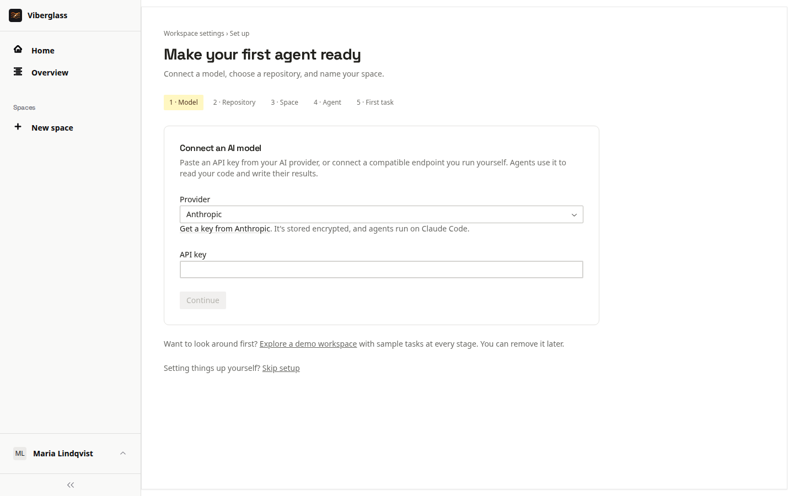

# Install with Docker

The quickest way to try Viberglass: one command on one machine, then a short setup in the browser. Agents run as Docker containers on the same machine.

This setup is for trying Viberglass on your own machine. It runs the development servers and uses fixed database and encryption keys, so don't expose it to a network. For an installation your team shares, use [Kubernetes](install-kubernetes.md) or [AWS](install-aws.md).

## Requirements

- Docker Engine 20.10 or newer, with Docker Compose v2.
- Free ports 3000 (the app), 8888 (the API) and 5432 (PostgreSQL).
- A model key from an AI provider, or the address of a compatible model endpoint.
- A GitHub repository, and a fine-grained access token for it.

## Start it

```bash
git clone https://github.com/Ilities/viberglass.git
cd viberglass
docker compose up
```

The first start builds the backend and frontend, so it takes a few minutes. The backend runs its database migrations on startup. When it's up, open http://localhost:3000.

## First-run setup

The first visit asks you to create the administrator account: your name, email and password. Setup then walks through the rest.

1. Connect an AI model. Pick the provider that issued your key and paste it; setup checks it with the provider. Or choose Custom endpoint for a provider such as z.ai or a model you run yourself: enter the API base URL, the API it speaks, the endpoint's key and a model (Find models lists them). See [Agents and models](agents-and-models.md).
2. Point at your repository. Enter the GitHub repository and an access token. "Create a token with the right permissions" opens GitHub's fine-grained token form with what the agent needs filled in: write access to Contents and Pull requests. Setup checks the token with GitHub.
3. Name your first space.
4. Getting your agent ready. Setup creates a default agent for your key and starts it on Docker. The first time, this downloads the agent's image and takes a couple of minutes.
5. Try your first task. Setup suggests a starter task that only reads your code; choose Write the plan to run it.

To look around before connecting anything, choose Explore a demo workspace on setup's first screen. It loads a sample space with tasks in different states. Its tasks don't run agents. Remove demo, in the demo's banner, deletes exactly what it added.



## Worker images

Agents run in worker images pulled from `ghcr.io/ilities`, one per coding agent. To use images you built yourself, set `VIBERATOR_WORKER_REGISTRY` to empty in a `.env` file in the repository root, and restart the backend.

## Optional services

Optional settings go in a `.env` file in the repository root. Restart the backend after changing it with `docker compose up -d backend`.

- Email: Mailpit catches mail locally. Set `EMAIL_FROM` and `SMTP_URL=smtp://mailpit:1025`, then start it with `docker compose --profile mail up -d`. Its inbox is at http://localhost:8025. For real delivery, point `SMTP_URL` at your SMTP server.
- Slack: set `SLACK_BOT_TOKEN` and `SLACK_SIGNING_SECRET`. Slack needs to reach the backend over HTTPS, so locally you need a tunnel such as ngrok. See [Repositories and integrations](repositories-and-integrations.md#slack).
- Traces: `docker compose --profile langfuse up -d` starts Langfuse for looking at agent traces.

More detail is in [local development](https://github.com/Ilities/viberglass/blob/main/docs/local-development.md).

## Stop and start

`docker compose down` stops everything; your data stays in Docker volumes. `docker compose up` starts it again. To update, `git pull` and run `docker compose up --build`. See [Upgrades and backups](upgrades-and-backups.md).
