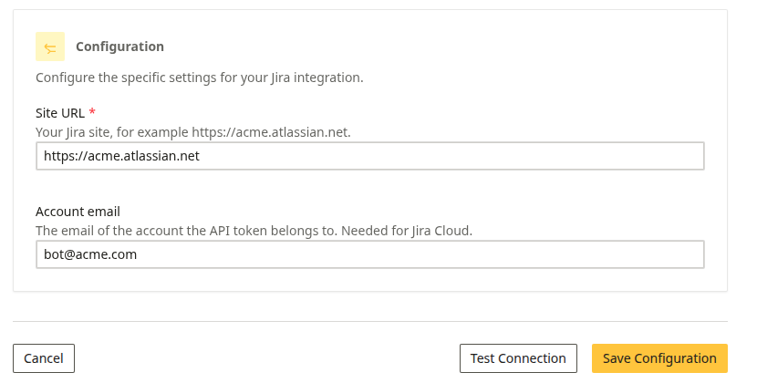
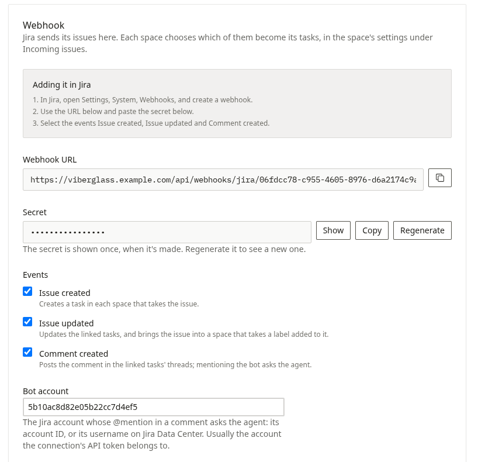
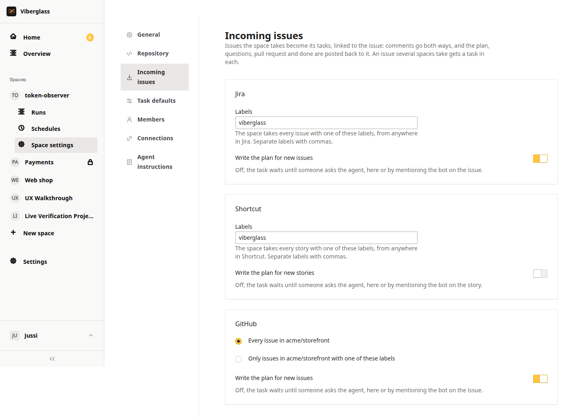
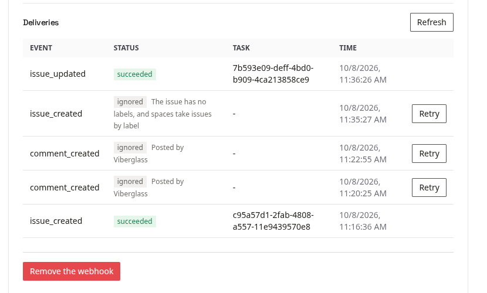

# Issue trackers

Connect GitHub Issues, Jira or Shortcut, and issues become tasks in Viberglass. Each task stays linked to its issue: comments go both ways, and the plan, the agent's questions, the pull request and done are posted back to the issue. People who live in the tracker can follow the work and take part without opening Viberglass.

Setting it up has two halves:

- A workspace admin connects the tracker once, under Settings → Connections. The connection holds the token Viberglass posts with, and one webhook the tracker sends its events to.
- Each space chooses which issues it takes, under Space settings → Incoming issues. A space maintainer does this, and can change it any time.

## Before you start

The tracker has to reach your Viberglass backend over HTTPS. On a server install that's your backend's public address. When you try Viberglass on your own machine, use a tunnel such as `ngrok http 8888` and give the tracker the tunnel's address.

Use a separate account for the bot if you can, such as a "Viberglass" user in Jira or Shortcut. Its token posts the comments, and mentioning it in a comment asks the agent. Your own account works too, but then your comments and the bot's look alike in the tracker.

## Connect a tracker

### GitHub

GitHub needs no separate token: Viberglass comments on issues with the token of the GitHub connection your repositories use.

1. Open Settings → Connections → GitHub, and under Webhook choose Set up the webhook.
2. Copy the webhook URL and the secret. The secret is shown once; if you lose it, choose Regenerate and update it in GitHub.
3. In GitHub, open the repository's Settings → Webhooks → Add webhook. To cover every repository of an organisation at once, add it under the organisation's settings instead.
4. Paste the URL as the Payload URL, set the content type to `application/json`, and paste the secret.
5. Choose "Let me select individual events" and tick Issues and Issue comments.
6. Optionally, set the bot account to the GitHub login whose @mention asks the agent. Leave it empty if the connection's token is your own: comments by the bot login are never read back, so yours would be ignored.

GitHub issues go to the space that uses their repository, without any further setup. See [Choose which issues a space takes](#choose-which-issues-a-space-takes) to narrow that down or have the plan written.

### Jira Cloud

Adding the webhook in Jira needs a Jira administrator.

1. Create an API token for the bot account at id.atlassian.com → Security → API tokens. Note the account's ID too: it's the last part of the address of its Jira profile.
2. In Viberglass, open Settings → Connections → Jira. Enter the Site URL, such as `https://acme.atlassian.net`, and the bot account's email, and choose Save Configuration.
3. Under Credentials on the same page, add the API token, then choose Test Connection.

4. Under Webhook, choose Set up the webhook, and copy the URL and the secret.
5. Set the bot account to the account ID from step 1, and choose Save.

6. In Jira, open Settings (the cog) → System → WebHooks → Create a WebHook. Paste the URL and the secret.
7. Under Events, tick Issue created, Issue updated and Comment created, and save. To send only some projects, add a JQL filter such as `project in (WEB, API)`.

On Jira Data Center, set the bot account to the bot's username instead of an account ID.

### Shortcut

1. Create an API token for the bot member under Settings → Your Account → API Tokens in Shortcut. Note the member's mention name.
2. In Viberglass, open Settings → Connections → Shortcut and add the token under Credentials.
3. Under Webhook, choose Set up the webhook, and copy the URL and the secret.
4. Set the bot account to the mention name, without the @, and choose Save.
5. In Shortcut, open Settings → Integrations → Webhooks, add a webhook, and paste the URL and the secret. Shortcut sends story and comment changes to it.

## Choose which issues a space takes

Open the space's Space settings → Incoming issues. There's a card for each connected tracker.

- Jira and Shortcut go by label. List the labels the space takes, separated by commas. An issue with one of them, from any project in the Jira site or Shortcut workspace, becomes the space's task. Case doesn't matter.
- GitHub goes by repository. Every issue in the space's repository comes in, or choose "Only issues … with one of these labels" and list them.
- Write the plan for new issues has the agent start on the plan as soon as an issue arrives. With it off, the task waits until someone asks the agent, in Viberglass or by mentioning the bot on the issue. Nothing is built before there's a plan.

Choose Save after a change. On the connection's page, Spaces taking its issues lists the spaces that have set what they take.

A few things to know:

- An issue that several spaces take gets a task in each. The page tells you when another space already takes a label you add. Comments on the issue reach every one of its tasks, and what Viberglass posts back to the issue starts with the space's name.
- An issue that no space takes is ignored. Adding the label afterwards brings it in, since an edit is routed again.
- Once a task exists it stays linked to its issue. Removing the label, or changing what the space takes, doesn't remove or move it.

## How an issue and its task stay in step

- A new issue creates a task in each space that takes it. The person who opened it becomes the task's requester when their email matches a Viberglass account.
- Editing the issue's title or description updates its tasks.
- A comment on the issue appears in the task's thread, as the Viberglass person whose email matches the commenter, or otherwise under the commenter's name and where they wrote, such as "Pat · on Jira". Jira Cloud often hides people's email, so expect names there.
- A comment that mentions the bot account asks the agent, like mentioning it in the thread. A reply from the person the agent asked answers its question.
- Viberglass comments on the issue when the plan is ready, with a short summary and a link, when the agent asks a question, when it opens the pull request, and when the task is done. When the agent was asked from the issue, its reply is posted there too. Messages written in Viberglass stay in Viberglass, and Viberglass never reads its own comments back as new messages.

## Copy a task to another space

A space works in one repository. When a task turns out to need changes in another space's repository too, open the task's Actions menu and choose Copy to another space. The copy is a new task with the same title and description, and both threads link to each other. The tracker issue stays linked to the original task.

## When an issue doesn't arrive

Every delivery from the tracker is listed under Deliveries on the connection's page, newest first.

- succeeded: the event created or updated a task. The task column says which.
- ignored: Viberglass received the event and chose not to act on it. The reason is shown next to it, such as "No space takes issues labelled 'bug'" or "Posted by Viberglass" for its own comments. After changing what a space takes, choose Retry to run the event again.
- failed: the event was refused or something went wrong, such as a signature that doesn't match. Regenerate the secret, paste it into the tracker again, and choose Retry.

If nothing is listed at all, the tracker isn't reaching Viberglass. Check that the URL in the tracker is the one on the connection's page, that it uses your public address, and the tracker's own delivery log. GitHub shows recent deliveries under the webhook's settings; Jira and Shortcut keep fewer details.
