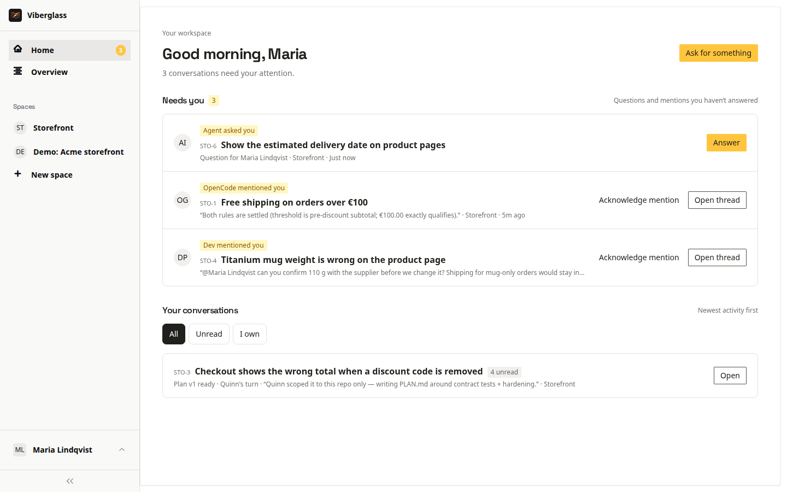

# Getting started

The words Viberglass uses, what you see when you sign in, and what your role in the workspace lets you do. Read this first if someone has invited you to a workspace.

## Signing in

Open the invitation link you were sent, enter your name and a password, and join. After that, sign in at your workspace's address with your email and password. If you forget your password, ask a workspace admin for a reset link.

## The words

- Workspace: the whole installation, with its people, agents and connections.
- Space: a group of related tasks, usually one product or one repository. Each space has its own members, defaults and settings.
- Task: something someone wants done. It has a key such as WEB-42, a description, people, a plan, code, and one conversation thread.
- Thread: the task's conversation. Messages from people, the agent's questions and replies, plan revisions, comments, runs and pull requests all appear there, in order.
- Plan: the document an agent writes before building. It says what the agent found in the code and what it would change.
- Code: the pull requests the agent opens when it builds the plan.
- Agent: the coding agent that does the work, such as Claude Code, Codex or OpenCode. An admin sets up the agents and the models they use; you ask them for things from a task.
- Run: one piece of work by an agent, such as writing the plan. Each run has a record of what the agent did.

## People on a task

Each task has people in different places on it. These are not workspace roles; the same person can own one task and review another.

- Requester: who created the task.
- Owner: who moves it forward and decides when it's done. By default, the person who created it.
- Reviewers: people asked to look at the plan or the result.
- Watchers: people who follow the task. Watching is taking part: watchers can comment and ask the agent, within their role.

The task page lists them under People. The note "What owner, reviewer and watcher mean" explains them on the task itself.

## What you see

The sidebar has Home, Overview, and your spaces.

- Home shows your conversations and anything that needs you: a question from the agent, a review request, a mention, or your move on a task you own. See [Home and notifications](home-and-notifications.md).
- Overview shows work across every space you can see: what needs attention, what agents are working on now, what waits on people, and what hasn't started.
- A space shows its tasks as a board or a table, with search and filters.
- Settings has your own notification settings. Admins also see the workspace's settings there.

## What your role lets you do

Your workspace role is set when you're invited. Under Settings → Members, admins can open "What each role can do" for the same table.

| | Admin | Member | Guest | Viewer |
|---|---|---|---|---|
| See spaces | Every space | Open spaces, and private ones they belong to | Only spaces they are invited to | Open spaces, and private ones they belong to |
| Comment and post | Yes | Yes | Yes | No |
| Ask the agent for a plan | Yes | Yes | On tasks they are on | No |
| Ask the agent for code | Yes | On tasks they are on, or as a space maintainer | On tasks they are on | No |
| Pause, take over and hand back | Yes | As the task owner or a space maintainer | As the task owner | No |
| Agents, connections, secrets and members | Yes | No | No | No |

Members and admins create spaces and tasks. Guests work on the tasks they're on in the spaces they were invited to. Viewers read: they land on Overview and can open any task they can see, but can't post or ask the agent anything.

If a space or a task link doesn't open for you, you probably don't have access to that space. Ask an admin or the space's maintainer.

## Next

- [Tasks](tasks.md): ask for something.
- [Plans and reviews](plans-and-reviews.md): work on the plan with the agent and your team.
