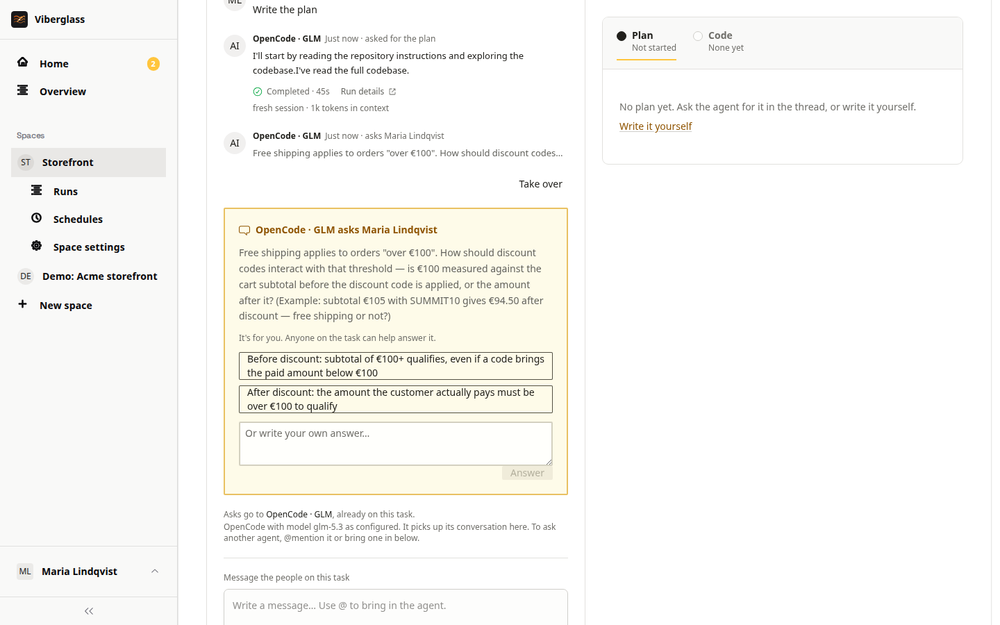

# Plans and reviews

Before an agent writes code, it can write a plan: what it found in the code and what it would change. This page covers asking for the plan, reviewing it with your team, answering the agent's questions, and asking for revisions.

## Asking for a plan

On a new task, choose Write the plan under the thread. The agent reads the repository and the task, and writes one document with what it found and what it would change. It appears under the task's Plan tab, and the thread shows a turn for it.

You don't have to start with a plan. Anyone who can ask for code can choose Build it straight away, which suits small, clear changes. Nothing has to be approved before a build.

If the agent finishes without writing the plan, the turn shows as failed rather than done, so you know to ask again.

## When the agent asks a question

If the agent needs a decision it can't make from the code, it asks in the thread and waits. The question card says who it's for, and shows on that person's Home.

Type an answer and choose Answer, or pick one of the options the agent offered. Give a decision rather than "looks good" when wording, scope or what counts as done is still open.

Anyone on the task can answer, even if the question was for someone else. The thread records who answered for whom, such as "Quinn answered for Maria". If answers conflict, say which one stands.

The space can remind people about unanswered questions after a while; ask your space's maintainer.

## Reviewing the plan

Open the Plan tab and read the plan against what was asked.

To comment on part of it:

1. Select the text you want to comment on.
2. Choose Comment, write what should change and why, and choose Add comment.
3. For exact replacement wording, choose Suggest a change instead and write the new text.

Open comments are highlighted in the plan; click one to read it. A suggestion can be applied with Apply suggestion while its text is still in the plan. Resolve closes a comment, and Reopen opens it again. Each comment also appears in the thread with a short quote of the text it's on, its state, and Open in comments.

Specific comments work best: "Keep the exact string Welcome to Acme without punctuation, and add a test that asserts it."

<!-- screenshot: plan with a selected passage and the comment composer -->

## Asking for a revision

Once there are open comments, the suggested actions include "Revise the plan with N comments". It sends the agent every comment made since the plan's latest version. Read the new version rather than assuming each comment was applied.

You can also ask for a change in the thread: type @, pick the agent, write the change, and choose Post. If you're allowed to edit the plan, you can also edit it directly.

## Versions

Each revision of the plan is a version. A link to an older version opens it read-only, labelled as older, with Compare with current to see what changed. Comments and edits always go on the current version.

## Bringing people in

- Add reviewers under People on the task. They're sent a review request by Slack DM if they've linked Slack, and the task shows on their Home when it's their move.
- Mention someone: type @, pick the person, and post. The mention shows on their Home until they reply or choose Acknowledge mention.
- Watchers follow the task and can take part in the conversation.

A space can add default reviewers to every new task; ask your space's maintainer.

## Summaries

When a thread has grown long, the suggested actions include Summarise so far. The agent writes a summary of the conversation in the thread. It helps people catching up, and the next agent turn starts from it.

## Next

When the plan is agreed, see [Building and pull requests](building-and-prs.md).
