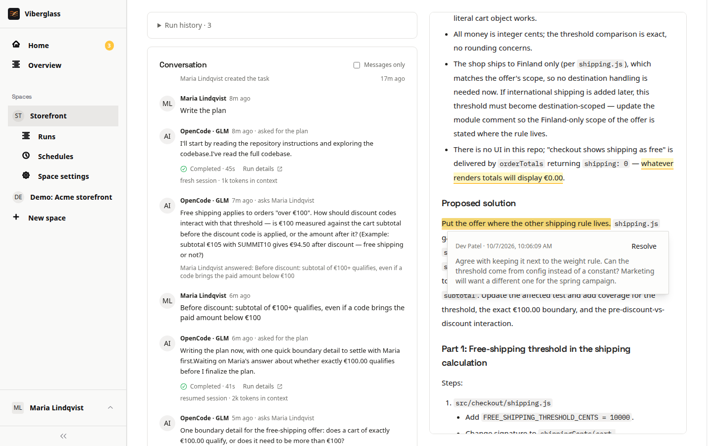

# Tasks

A task is something someone wants done, and the place where people and the agent work on it together. This page covers creating tasks from the web, Slack and issue trackers, and reading a task's page.

## Creating a task on the web

1. On Home, choose Ask for something. If you're in more than one space, pick the space from its menu. You can also open a space and create the task there.
2. Give it a title that states the outcome, such as "Change the welcome text to Welcome to Acme".
3. In the description, write what you want, any context the agent wouldn't find in the code, and how you'll know it's right. You don't need to know which files are involved.
4. Optionally set the severity and category, and attach a screenshot or a screen recording.
5. Choose Create Task.

The task opens. You're its owner unless the space sets a different default owner. Nothing runs yet: choose Write the plan to ask the agent for a plan, or Build it if the change is small and clear. See [Plans and reviews](plans-and-reviews.md).

A good description is concrete. "Make the welcome text say Welcome to Acme, without punctuation. Keep the existing function signature. Add a test for the exact text." gives the agent and your reviewers the same target.

<!-- screenshot: Create New Task form -->

## Other ways tasks start

- From Slack, with `/viberator`. The task gets a Slack thread that stays in step with it. See [Slack](slack.md).
- From an issue tracker. If the space is linked to GitHub Issues or Shortcut, new issues become tasks linked to them. Comments on the issue appear in the task's thread, mentioning the bot there asks the agent, and Viberglass posts the plan, its questions, the pull request and when it's done back to the issue. Ask your admin how your space is set up.
- From a custom webhook, for tools that can send an HTTP request.
- From the [Chrome extension](chrome-extension.md), with a screenshot and the page's details attached.
- From an MCP client, with the `task_create` tool. See [MCP server](mcp.md).
- On a schedule. See [Schedules](schedules.md).

## The task page

At the top: the title, the task's key and status, and Actions. Below that:

- Description: what was asked for. Task details folds away the key, severity, category and created date.
- People: the owner, reviewers and watchers. Choose Watch to follow the task, or Stop watching to leave it.
- Plan and Code: the task's artifacts, as tabs. Each shows where it stands, such as None yet, Agent working, Written or Pull request open. Either can be asked for at any time.
- The thread: the conversation, newest at the bottom, with the composer and suggested next steps under it.

On a phone, switch between Conversation and Artifacts at the top.

## Writing in the thread

Write a message and choose Post. A plain message is for people: the agent reads the whole thread the next time someone asks it for something, but a message alone doesn't start it.

Type @ to mention someone. Pick a person to ask for their attention; it shows on their Home. Pick an agent to ask that agent for something; your message is the request. The line above the suggested actions says which agent your next request goes to, and whether it picks up its earlier conversation or starts fresh from the task and its documents.

If the agent is working when you post, your message waits until it finishes its turn.

## Each agent turn

Each time the agent works, the thread shows what it set out to do and a result line, such as "Wrote the plan". Show what it said opens its full reply. A run that failed says why, who can fix it, and offers Try again when trying again could help.

Run details opens the record of the run: what the agent did step by step, its tool calls, the prompt it got, the worker's log, and the model, time and cost where the agent reports them.

## The Actions menu

- Edit details: change the title, description and other details.
- View screenshots: open attached media.
- Copy link: copy the task's address.
- Finish task: close the task by hand. Its history stays, and nothing is merged. Reopen task opens it again.
- Archive: take the task out of the space's working lists while keeping its record.
- Delete task: remove it, for those allowed to.

What you see in the menu depends on your role and your place on the task.
