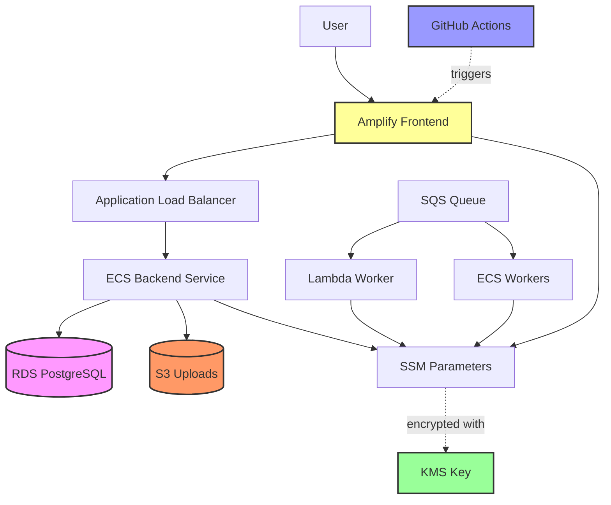
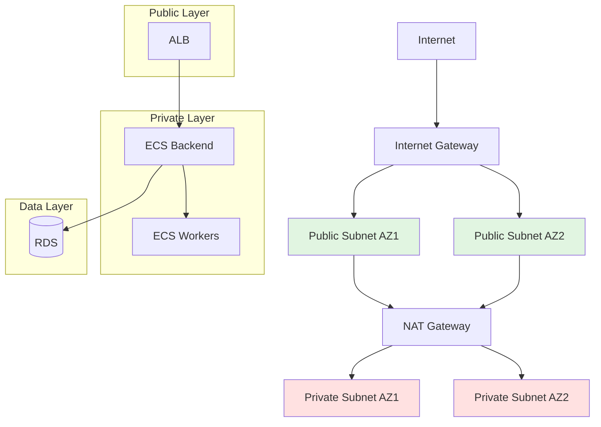
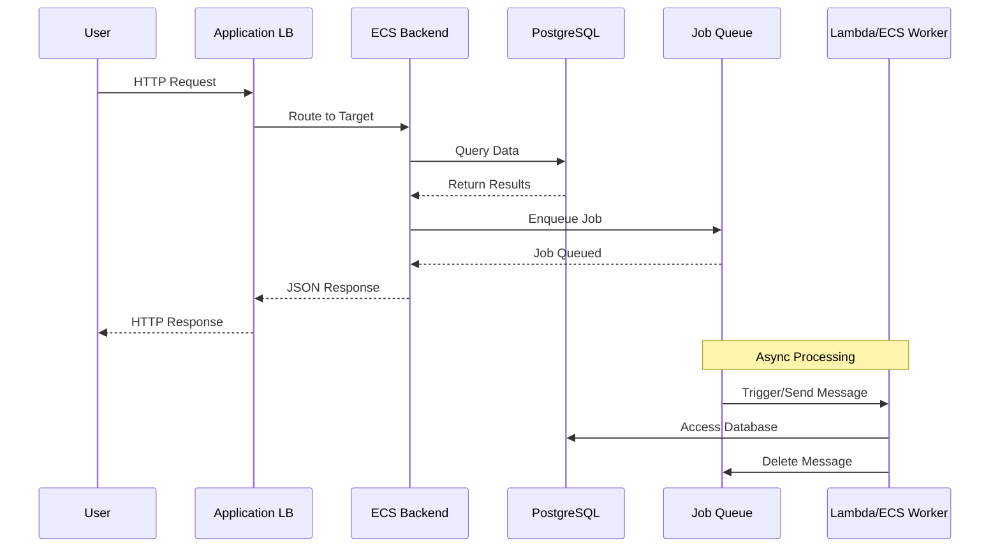
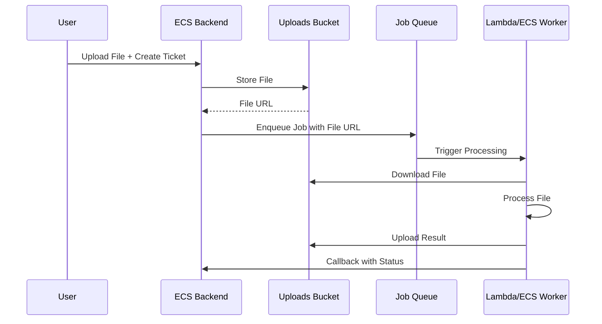
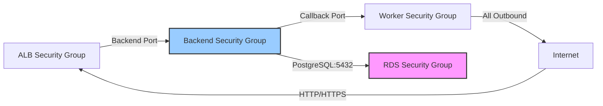

# Viberglass AWS Infrastructure

Pulumi-based AWS infrastructure for Viberglass - a platform where users create tickets that coding agents automatically fix.

## Overview

This infrastructure is organized into three separate Pulumi stacks to enable resource sharing and cost optimization:

### Three-Stack Architecture

```
infra/
├── base/              # Shared infrastructure (VPC, KMS, Logging)
├── platform/          # Backend & Frontend (ECS, ALB, Database, Amplify)
└── workers/           # Worker infrastructure (Lambda, ECS workers, SQS)
```

**Stack Dependencies:**

```
     ┌──────────────┐
     │    base      │
     │  (VPC, KMS)  │
     └──────────────┘
           │
     ┌─────┴─────┐
     ▼           ▼
┌─────────┐ ┌─────────┐
│platform │ │ workers │
│(BE/FE)  │ │(ECS/λ)  │
└─────────┘ └─────────┘
```

### Stack Resources

**Base Stack (`infra/base/`):**

- **VPC** - Networking with public/private subnets, NAT gateways, and security groups
- **KMS** - Customer-managed encryption keys for SSM parameters
- **Logging** - CloudWatch log groups with environment-specific retention

**Platform Stack (`infra/platform/`):**

- **Database** - RDS PostgreSQL 16 with automated backups
- **Storage** - S3 buckets for file uploads with lifecycle policies
- **Registry** - ECR repository for container images
- **Backend** - ECS Fargate service with Application Load Balancer
- **Amplify** - Frontend SSR hosting with GitHub Actions deployment

**Workers Stack (`infra/workers/`):**

- **Registry** - ECR repository for worker images
- **Queue** - SQS queue with dead-letter queue for job processing
- **Workers** - Lambda and ECS Fargate for job execution
- **Slack App** - Lambda + Function URL + DynamoDB installation store

## Architecture



## Network Diagram



## Data Flow Diagrams

### User Request Flow



### File Upload Flow



### Security Group Relationships



## Prerequisites

- **Pulumi CLI** - Install from https://www.pulumi.com/docs/install/
- **AWS Credentials** - Configured via AWS CLI or environment variables
- **Node.js 20+** - For running Pulumi and building container images
- **Docker** - For local container builds during development

### Installing Pulumi CLI

```bash
# Using curl
curl -fsSL https://get.pulumi.com | sh

# Or using Homebrew (macOS)
brew install pulumi

# Verify installation
pulumi version
```

### Configuring AWS Credentials

```bash
# Using AWS CLI
aws configure

# Or set environment variables
export AWS_ACCESS_KEY_ID=your_access_key
export AWS_SECRET_ACCESS_KEY=your_secret_key
export AWS_DEFAULT_REGION=eu-west-1
```

## Pulumi State Backend

Before running Pulumi, set up an S3 bucket to store the state file securely.

### Setup S3 Backend

```bash
# Run the setup script (default: viberglass-pulumi-state in eu-west-1)
./setup-pulumi-state.sh

# Or specify custom bucket name and region
./setup-pulumi-state.sh my-pulumi-state eu-west-1
```

This script creates an S3 bucket with:

- Versioning enabled
- Server-side encryption (AES-256)
- Public access blocked
- Lifecycle policy (old versions expire after 90 days)

### Configure Pulumi to Use S3 Backend

```bash
# Login to the S3 backend
pulumi login s3://viberglass-pulumi-state

# Or set as environment variable
export PULUMI_BACKEND_URL=s3://viberglass-pulumi-state
```

## Quick Start

### 1. Install Dependencies

```bash
# Install dependencies for all stacks
cd infra/base && npm install
cd ../platform && npm install
cd ../workers && npm install
```

### 2. Deploy in Order

**Important:** Stacks must be deployed in this order due to dependencies.

#### Step 1: Deploy Base Stack (VPC, KMS, Logging)

```bash
cd infra/base
pulumi stack select dev
pulumi up
```

#### Step 2: Deploy Platform Stack (Backend, Database, Amplify)

```bash
cd infra/platform
pulumi stack select dev
pulumi up
```

#### Step 3: Deploy Workers Stack (Lambda, ECS Workers, SQS)

```bash
cd infra/workers
pulumi stack select dev
pulumi up
```

**Note:** Platform and Workers stacks can be deployed in parallel after Base is complete.

### 3. Configure Stack (if needed)

```bash
# Set AWS region (already configured in stack files)
pulumi config set aws:region eu-west-1

# Verify configuration
pulumi config
```

### 4. Preview Changes

```bash
pulumi preview
```

Available stacks per project: `dev`, `prod`

## Stack Outputs

After deployment, retrieve connection details:

```bash
pulumi stack output
```

### Available Outputs

| Output                     | Description                                      |
| -------------------------- | ------------------------------------------------ |
| `awsRegion`                | AWS region where resources are deployed          |
| `environment`              | Environment name (dev/staging/prod)              |
| `networkMode`              | Network mode (enterprise or standard)            |
| `vpcId`                    | VPC ID                                           |
| `vpcCidr`                  | VPC CIDR block                                   |
| `publicSubnetIds`          | Public subnet IDs                                |
| `privateSubnetIds`         | Private subnet IDs                               |
| `databaseEndpoint`         | RDS PostgreSQL endpoint                          |
| `databasePort`             | Database port (5432)                             |
| `databaseSsmUrlPath`       | SSM path for DATABASE_URL                        |
| `databaseSsmHostPath`      | SSM path for database host                       |
| `databaseInstanceArn`      | RDS instance ARN                                 |
| `databaseName`             | Database name                                    |
| `repositoryUrl`            | ECR repository URL                               |
| `repositoryArn`            | ECR repository ARN                               |
| `queueUrl`                 | SQS queue URL                                    |
| `queueArn`                 | SQS queue ARN                                    |
| `lambdaArn`                | Lambda worker function ARN                       |
| `lambdaName`               | Lambda worker function name                      |
| `slackAppFunctionUrl`      | Slack app Lambda Function URL                    |
| `slackAppLambdaArn`        | Slack app Lambda function ARN                    |
| `slackInstallationsTableName` | Slack app DynamoDB table name                 |
| `ecsClusterArn`            | ECS cluster ARN                                  |
| `ecsClusterName`           | ECS cluster name                                 |
| `ecsTaskDefinitionArn`     | ECS worker task definition ARN                   |
| `workerSubnets`            | ECS worker subnet IDs (derived from networkMode) |
| `workerAssignPublicIp`     | ECS worker public IP setting (true/false)        |
| `uploadsBucketName`        | S3 uploads bucket name                           |
| `uploadsBucketArn`         | S3 uploads bucket ARN                            |
| `kmsKeyId`                 | KMS key ID                                       |
| `kmsKeyArn`                | KMS key ARN                                      |
| `lambdaLogGroupName`       | Lambda worker log group name                     |
| `ecsWorkerLogGroupName`    | ECS worker log group name                        |
| `backendLogGroupName`      | Backend service log group name                   |
| `backendUrl`               | Backend API URL (ALB DNS name)                   |
| `backendServiceArn`        | Backend ECS service ARN                          |
| `albDnsName`               | Application Load Balancer DNS name               |
| `albArn`                   | ALB ARN                                          |
| `albTargetGroupArn`        | ALB target group ARN                             |
| `amplifyAppId`             | Amplify application ID                           |
| `amplifyAppArn`            | Amplify application ARN                          |
| `amplifyDefaultDomain`     | Amplify app default domain                       |
| `amplifyBranchName`        | Amplify branch name                              |
| `amplifyOidcRoleArn`       | IAM role ARN for GitHub Actions                  |
| `amplifySsmAppIdPath`      | SSM path for app ID                              |
| `amplifySsmBranchNamePath` | SSM path for branch name                         |
| `amplifySsmRegionPath`     | SSM path for region                              |

## Configuration

Stack configuration is stored in `Pulumi.{stack}.yaml` files.

### Configuration Keys

**Base Stack (`infra/base/`):**

| Config Key         | Type   | Default           | Description                                                                                       |
| ------------------ | ------ | ----------------- | ------------------------------------------------------------------------------------------------- |
| `aws:region`       | string | `eu-west-1`       | AWS region for all resources                                                                      |
| `awsRegion`        | string | (from aws:region) | Viberglass-specific region config                                                                 |
| `environment`      | string | `dev`             | Environment name (dev/staging/prod)                                                               |
| `networkMode`      | string | `enterprise`      | Network mode: `enterprise` (private subnets + NAT) or `standard` (public compute subnets, no NAT) |
| `singleNatGateway` | bool   | (per env)         | Use single NAT for cost savings                                                                   |
| `logRetentionDays` | number | (per env)         | CloudWatch log retention                                                                          |

**Platform Stack (`infra/platform/`):**

| Config Key                  | Type   | Default           | Description                                        |
| --------------------------- | ------ | ----------------- | -------------------------------------------------- |
| `aws:region`                | string | `eu-west-1`       | AWS region for all resources                       |
| `awsRegion`                 | string | (from aws:region) | Viberglass-specific region config                  |
| `environment`               | string | `dev`             | Environment name (dev/staging/prod)                |
| `baseStack`                 | string | **required**      | Base stack reference (e.g., "viberglass-base/dev") |
| `enableSpot`                | bool   | `false`           | Use Fargate Spot for workers (dev only)            |
| `containerInsights`         | bool   | `true`            | Enable ECS Container Insights                      |
| `dbInstanceClass`           | string | (per env)         | RDS instance class                                 |
| `dbAllocatedStorage`        | number | (per env)         | RDS storage in GB                                  |
| `amplifyGithubAccessToken`  | string | (none)            | GitHub token for Amplify auto-deployment (secret)  |

**Workers Stack (`infra/workers/`):**

| Config Key          | Type   | Default           | Description                                        |
| ------------------- | ------ | ----------------- | -------------------------------------------------- |
| `aws:region`        | string | `eu-west-1`       | AWS region for all resources                       |
| `awsRegion`         | string | (from aws:region) | Viberglass-specific region config                  |
| `environment`       | string | `dev`             | Environment name (dev/staging/prod)                |
| `baseStack`         | string | **required**      | Base stack reference (e.g., "viberglass-base/dev") |
| `enableSpot`        | bool   | `false`           | Use Fargate Spot for workers (dev only)            |
| `containerInsights` | bool   | `true`            | Enable ECS Container Insights                      |
| `slack:enabled`     | bool   | `false`           | Enable Slack app Lambda resources                  |
| `slack:clientId`    | string | (none)            | Slack app client ID                                |
| `slack:clientSecret`| string | (none)            | Slack app client secret (secret)                   |
| `slack:signingSecret`| string | (none)           | Slack signing secret (secret)                      |
| `slack:stateSecret` | string | (none)            | Slack OAuth state secret (secret)                  |
| `slack:scopes`      | string | (optional)        | Comma-delimited Slack bot scopes                   |
| `slack:logLevel`    | string | `info`            | Slack app log level                                |
| `slack:appBaseUrl`  | string | (optional)        | Public base URL for install links                  |

#### Valid Values Reference

**Database Instance Classes:**

| Instance        | vCPU | Memory | Cost/month | Environment |
| --------------- | ---- | ------ | ---------- | ----------- |
| `db.t4g.micro`  | 2    | 1 GB   | ~$15       | Dev         |
| `db.t4g.large`  | 2    | 8 GB   | ~$70       | Staging     |
| `db.m6g.xlarge` | 4    | 16 GB  | ~$180      | Production  |

**Log Retention Options:**

| Value | Retention | Use Case    |
| ----- | --------- | ----------- |
| 1     | 1 day     | Debugging   |
| 7     | 1 week    | Development |
| 30    | 1 month   | Staging     |
| 90    | 3 months  | Production  |
| 365   | 1 year    | Compliance  |

### Environment Defaults

#### Development (dev)

```yaml
dbInstanceClass: db.t4g.micro
dbAllocatedStorage: 20
networkMode: enterprise # set to standard for public compute subnets + no NAT
singleNatGateway: true
logRetentionDays: 7
enableSpot: true
```

#### Staging

```yaml
dbInstanceClass: db.t4g.large
dbAllocatedStorage: 50
networkMode: enterprise # set to standard for public compute subnets + no NAT
singleNatGateway: true
logRetentionDays: 30
enableSpot: false
```

#### Production

```yaml
dbInstanceClass: db.m6g.xlarge
dbAllocatedStorage: 100
networkMode: enterprise # set to standard for public compute subnets + no NAT
singleNatGateway: false # Multi-NAT for HA
logRetentionDays: 90
enableSpot: false
```

### Setting Configuration Values

```bash
# Set a value
pulumi config set dbInstanceClass db.t4g.micro

# Set a boolean
pulumi config set enableSpot true

# Set a number
pulumi config set logRetentionDays 30

# Set an encrypted secret
pulumi config set --secret dbPassword
```

## Components

### VPC Component (`components/vpc.ts`)

Creates a Virtual Private Cloud with:

- Public subnets in 2+ AZs for internet-facing resources (ALB)
- Private subnets in 2+ AZs for application resources (ECS, RDS)
- NAT gateways for outbound internet access from private subnets
- Security groups for backend, RDS, and worker services
- Internet gateway and route tables

**Key Features:**

- Single NAT gateway for dev/staging (cost optimization)
- Multi-NAT for production (high availability)
- Security group references for inter-service communication

### Database Component (`components/database.ts`)

Creates an RDS PostgreSQL 16 instance with:

- Automated backups (retention per environment)
- Multi-AZ deployment for production
- SSM Parameter Store for secure credential storage
- KMS encryption for SecureString parameters

**SSM Parameters:**

- `/viberator/{environment}/db/username` - Database user
- `/viberator/{environment}/db/password` - Database password (encrypted)
- `/viberator/{environment}/db/url` - Full connection string
- `/viberator/{environment}/db/host` - Database endpoint

### Storage Component (`components/storage.ts`)

Creates S3 buckets for file uploads with:

- Server-side encryption (AES-256)
- Block public access
- Lifecycle policies by environment
- IAM policy for access

**Lifecycle Policies:**

| Environment | Object Expiration | Version Expiration | Transitions                              |
| ----------- | ----------------- | ------------------ | ---------------------------------------- |
| Dev         | 90 days           | 7 days             | None                                     |
| Staging     | Never             | 90 days            | Noncurrent -> IA after 30 days           |
| Prod        | Never             | 365 days           | Current -> IA -> Glacier -> Deep Archive |

### KMS Component (`components/kms.ts`)

Creates a customer-managed KMS key for:

- SSM Parameter Store encryption
- Alias: `alias/viberator-{environment}-ssm`
- Annual key rotation enabled
- IAM policies for Lambda, ECS, and backend roles

### Logging Component (`components/logging.ts`)

Creates CloudWatch log groups:

- `/aws/lambda/viberglass-{environment}-worker` - Lambda worker logs
- `/aws/lambda/viberglass-{environment}-slack-app` - Slack app Lambda logs
- `/ecs/viberglass-{environment}-worker` - ECS worker logs
- `/ecs/viberglass-{environment}-backend` - Backend service logs

### Registry Component (`components/registry.ts`)

Creates an ECR repository:

- Name: `{environment}-viberator`
- Force delete enabled for dev environments
- Lifecycle policies for image cleanup

### Queue Component (`components/queue.ts`)

Creates SQS infrastructure:

- Main queue for job messages
- Dead-letter queue for failed messages
- 15-minute visibility timeout (Lambda max)
- 4-day message retention
- Max 3 receive count before DLQ

### Worker Lambda Component (`components/worker-lambda.ts`)

Creates Lambda worker:

- Container-based Lambda from ECR image
- 15-minute timeout
- 2048 MB memory
- Triggered by SQS
- KMS and S3 access

### Worker ECS Component (`components/worker-ecs.ts`)

Creates ECS worker infrastructure:

- Fargate task definition (2 vCPU, 4 GB RAM)
- Reuses backend ECS cluster
- IAM roles for SSM, S3, KMS access
- CloudWatch logging

### Load Balancer Component (`components/load-balancer.ts`)

Creates Application Load Balancer:

- Internet-facing in public subnets
- Target group for backend service
- Health checks on `/health`
- Security group for backend integration

### Backend ECS Component (`components/backend-ecs.ts`)

Creates backend service:

- Fargate task definition (configurable CPU/memory)
- ECS service with ALB integration
- Auto-scaling on CPU (70%) and memory (80%)
- Health checks
- EnableExecuteCommand for debugging

**Auto-scaling by Environment:**

| Environment | CPU/Memory  | Min Tasks | Max Tasks |
| ----------- | ----------- | --------- | --------- |
| Dev         | 256/512 MB  | 1         | 3         |
| Prod        | 512/1024 MB | 2         | 10        |

### Amplify Frontend Component (`components/amplify-frontend.ts`)

Creates AWS Amplify application for SSR frontend hosting with:

- Amplify App with WEB_COMPUTE platform for Next.js SSR
- Main/production branch configuration
- Build spec for Next.js with .next output directory
- Environment variables (NEXT_PUBLIC_API_URL from backend)
- Auto-branch creation disabled for security
- SSM parameters for app ID, branch name, and region

**SSM Parameters:**

- `/viberator/{environment}/amplify/appId` - Amplify app ID
- `/viberator/{environment}/amplify/branchName` - Deployment branch name
- `/viberator/{environment}/amplify/region` - AWS region

### Amplify OIDC Component (`components/amplify-oidc.ts`)

Creates IAM OpenID Connect provider and role for GitHub Actions:

- OIDC provider trusting GitHub's token.actions.githubusercontent.com
- IAM role with assume role policy for GitHub repo
- Permissions for Amplify deployment and SSM parameter reading

## Deployment

### Building Container Images

Images are built automatically by Pulumi using `awsx.ecr.Image`:

```typescript
const backendImage = new awsx.ecr.Image("backend", {
  repositoryUrl: repositoryUrl,
  context: path.join(__dirname, "../apps/platform-backend"),
  dockerfile: path.join(__dirname, "../apps/platform-backend/Dockerfile"),
  platform: "linux/amd64",
});
```

### Manual Image Build (Optional)

```bash
# Login to ECR
aws ecr get-login-password --region eu-west-1 | \
  docker login --username AWS --password-stdin \
  $(pulumi stack output repositoryUrl)

# Build image
docker build -t viberator-backend apps/platform-backend

# Tag image
docker tag viberator-backend:latest \
  $(pulumi stack output repositoryUrl):latest

# Push image
docker push $(pulumi stack output repositoryUrl):latest
```

### Deploying Backend

```bash
# Build and push new image, then update service
pulumi up

# Force new deployment without changes
pulumi up --target-replacements '[{"urn":"urn:pulumi:dev::viberator::aws:ecs/service:Service::dev-viberator-backend-service","forceNew":true}]'
```

### Frontend Deployment

Frontend is deployed via AWS Amplify SSR with environment-specific deployment strategies:

#### Development Environment

- **Trigger**: Push to `main` branch
- **Method**: GitHub Actions triggers Amplify deployment via AWS CLI
- **Build**: Built in GitHub Actions, deployed to Amplify

#### Production Environment

- **Trigger**: Push to `main` branch with GitHub environment approval gate
- **Method**: Git-based auto-deployment (Amplify connects directly to GitHub)
- **Build**: Built by Amplify on AWS infrastructure
- **Benefits**: Faster builds, native Amplify git integration, automatic rollbacks

**Configuration:**

- Platform: WEB_COMPUTE (SSR)
- Build output: .next directory
- Environment variable: NEXT_PUBLIC_API_URL (from backend ALB)
- Branch: `main` (all environments)

#### Setting Up Production Auto-Deployment

For production auto-deployment to work, you need to configure a GitHub access token:

1. **Create a GitHub Personal Access Token**:
   ```bash
   # Go to GitHub Settings → Developer settings → Personal access tokens
   # Create a token with 'repo' scope for private repositories
   # or 'public_repo' for public repositories
   ```

2. **Configure the token in Pulumi** (for production stack only):
   ```bash
   cd infra/platform
   pulumi stack select prod
   pulumi config set --secret amplifyGithubAccessToken ghp_your_token_here
   ```

3. **Deploy the updated infrastructure**:
   ```bash
   pulumi up
   ```

4. **Verify the connection**:
   - Go to AWS Amplify Console
   - Select your production app
   - Check that the repository is connected and showing "Connected" status

See `.github/workflows/deploy-frontend-dev.yml` and `.github/workflows/deploy-frontend-prod.yml` for CI/CD automation details.

## Troubleshooting

### View Logs

```bash
# Backend logs
aws logs tail /viberator/dev/backend --follow

# Lambda worker logs
aws logs tail /viberator/dev/lambda/worker --follow

# ECS worker logs
aws logs tail /viberator/dev/ecs/worker --follow
```

### Connect to Running Container (ECS Exec)

```bash
# Enable ECS Exec
pulumi up  # Ensure enableExecuteCommand: true

# Start session
aws ecs execute-command \
  --cluster $(pulumi stack output ecsClusterName) \
  --task $(task-id) \
  --container viberator-backend \
  --command "/bin/bash" \
  --interactive
```

### Common Issues

**Pulumi Not Found**

```bash
curl -fsSL https://get.pulumi.com | sh
export PATH=$PATH:$HOME/.pulumi/bin
```

**AWS Credentials Not Configured**

```bash
aws configure
# Or check: aws sts get-caller-identity
```

**Container Build Fails**

- Ensure Docker is running: `docker ps`
- Check context path in `backend-ecs.ts`
- Verify Dockerfile exists

**RDS Connection Timeout**

- Check security group allows backend SG on port 5432
- Verify RDS is in VPC
- Check backend has SSM permissions

**NAT Gateway Costs**

- Dev uses single NAT gateway (~$30/month)
- Check `singleNatGateway` config
- Consider removing NAT if workers don't need internet

**Amplify Deployment Fails**

- Run `pulumi up` to ensure Amplify app and SSM parameters exist
- Verify SSM parameters: `aws ssm get-parameter --name /viberator/dev/amplify/appId`
- Check GitHub Actions has OIDC role: `aws iam get-role --role-name dev-amplify-github-actions-role`

## Cost Management

### Monthly Cost Estimates (eu-west-1)

| Resource         | Dev   | Staging | Prod  |
| ---------------- | ----- | ------- | ----- |
| NAT Gateway      | $32   | $32     | $64   |
| RDS (t4g.micro)  | $15   | -       | -     |
| RDS (t4g.large)  | -     | $70     | -     |
| RDS (m6g.xlarge) | -     | -       | $180  |
| ALB              | $18   | $18     | $18   |
| ECS Backend      | $15   | $30     | $60   |
| ECS Workers      | $30   | $60     | $100  |
| Lambda           | $5    | $10     | $20   |
| S3 Storage       | $2    | $5      | $10   |
| CloudWatch Logs  | $5    | $10     | $20   |
| **Total**        | ~$122 | ~$235   | ~$472 |

### Cost-Saving Measures

1. **Dev Environment**: Single NAT, Spot instances, 7-day log retention
2. **Staging**: Single NAT, no Spot, 30-day log retention
3. **Production**: Multi-NAT for HA, 90-day logs, Glacier archiving

### Clean Up

**Important:** Destroy stacks in reverse order (workers → platform → base).

```bash
# Destroy workers stack first
cd infra/workers
pulumi destroy

# Then destroy platform stack
cd ../platform
pulumi destroy

# Finally destroy base stack (VPC, KMS, logging)
cd ../base
pulumi destroy

# Remove stacks (optional)
pulumi stack rm dev  # for each stack directory
```

## Security Notes

### SSM Parameter Paths

Credentials are stored in SSM Parameter Store with KMS encryption:

```
/viberator/dev/db/username - Standard string
/viberator/dev/db/password - SecureString (encrypted)
/viberator/dev/db/url - SecureString (encrypted)
/viberator/dev/db/host - SecureString (encrypted)
/viberator/dev/amplify/appId - Standard string
/viberator/dev/amplify/branchName - Standard string
/viberator/dev/amplify/region - Standard string
/viberator/dev/frontend/apiUrl - Standard string
/viberator/dev/deployment/region - Standard string
```

### KMS Key

- Customer-managed key: `alias/viberator-{environment}-ssm`
- Annual automatic rotation
- IAM policies grant `kms:Decrypt` and `kms:GenerateDataKey*`

### Security Groups

- **Backend SG**: Allows HTTP/HTTPS from ALB, backend port from VPC
- **RDS SG**: Allows PostgreSQL only from backend SG
- **Worker SG**: Allows all traffic from backend, egress to internet

### Access Control

- IAM roles for each component (Lambda, ECS task, execution)
- Least-privilege policies for SSM, S3, KMS, CloudWatch
- ECS Execute Command requires explicit enablement
