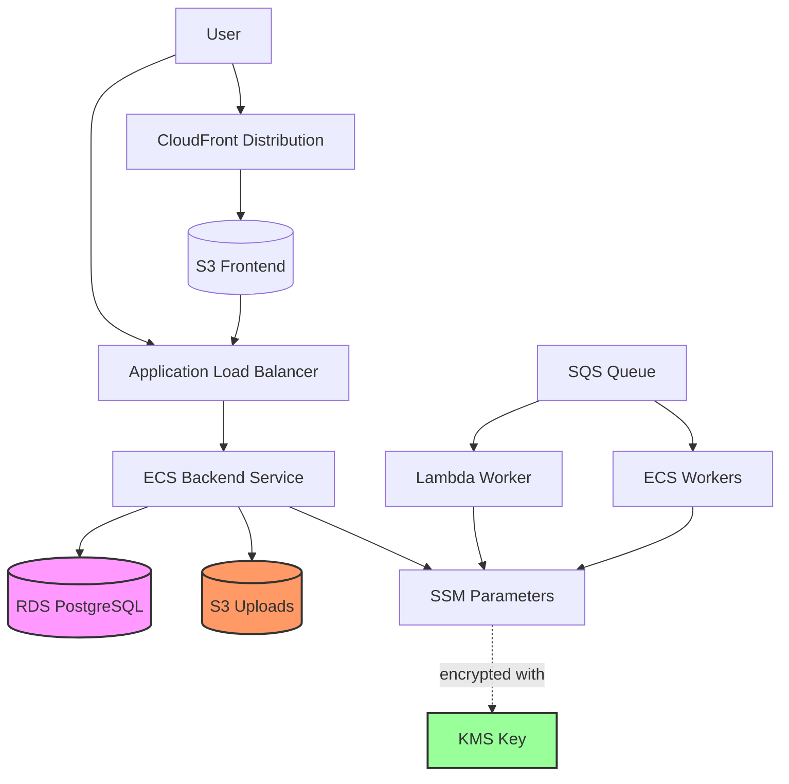
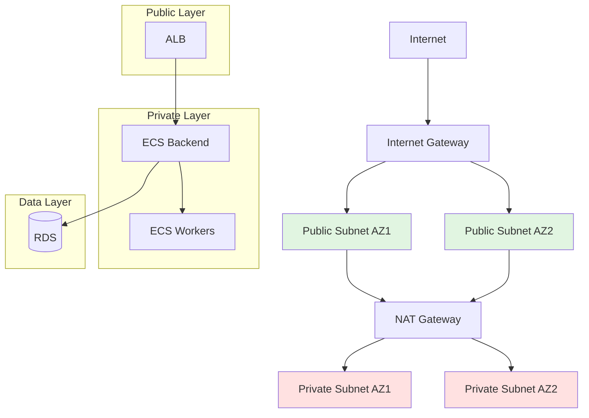

# Viberator AWS Infrastructure

Pulumi-based AWS infrastructure for Viberator - a platform where users create tickets that coding agents automatically fix.

## Overview

This infrastructure provisions all AWS resources required to run Viberator in production:

- **VPC** - Networking with public/private subnets, NAT gateways, and security groups
- **Database** - RDS PostgreSQL 16 with automated backups
- **Storage** - S3 buckets for file uploads with lifecycle policies
- **KMS** - Customer-managed encryption keys for SSM parameters
- **Logging** - CloudWatch log groups with environment-specific retention
- **Registry** - ECR repository for container images
- **Queue** - SQS queue with dead-letter queue for job processing
- **Workers** - Lambda and ECS Fargate for job execution
- **Backend** - ECS Fargate service with Application Load Balancer
- **Frontend** - S3 + CloudFront for static hosting (pending)

## Architecture



## Network Diagram



## Prerequisites

- **Pulumi CLI** - Install from https://www.pulumi.com/docs/install/
- **AWS Credentials** - Configured via AWS CLI or environment variables
- **Node.js 20+** - For running Pulumi and building container images
- **Docker** - For local container builds during development

### Installing Pulumi CLI

```bash
# Using curl
curl -fsSL https://get.pulumi.com | sh

# Or using Homebrew (macOS)
brew install pulumi

# Verify installation
pulumi version
```

### Configuring AWS Credentials

```bash
# Using AWS CLI
aws configure

# Or set environment variables
export AWS_ACCESS_KEY_ID=your_access_key
export AWS_SECRET_ACCESS_KEY=your_secret_key
export AWS_DEFAULT_REGION=us-east-1
```

## Quick Start

### 1. Install Dependencies

```bash
cd infrastructure
npm install
```

### 2. Select a Stack

```bash
pulumi stack select dev
```

Available stacks: `dev`, `staging`, `prod`

### 3. Configure the Stack

```bash
# Set AWS region
pulumi config set aws:region us-east-1

# Verify configuration
pulumi config
```

### 4. Preview Changes

```bash
pulumi preview
```

### 5. Deploy

```bash
pulumi up
```

## Stack Outputs

After deployment, retrieve connection details:

```bash
pulumi stack output
```

### Available Outputs

| Output | Description |
|--------|-------------|
| `awsRegion` | AWS region where resources are deployed |
| `environment` | Environment name (dev/staging/prod) |
| `vpcId` | VPC ID |
| `vpcCidr` | VPC CIDR block |
| `publicSubnetIds` | Public subnet IDs |
| `privateSubnetIds` | Private subnet IDs |
| `databaseEndpoint` | RDS PostgreSQL endpoint |
| `databasePort` | Database port (5432) |
| `databaseSsmUrlPath` | SSM path for DATABASE_URL |
| `databaseSsmHostPath` | SSM path for database host |
| `databaseInstanceArn` | RDS instance ARN |
| `databaseName` | Database name |
| `repositoryUrl` | ECR repository URL |
| `repositoryArn` | ECR repository ARN |
| `queueUrl` | SQS queue URL |
| `queueArn` | SQS queue ARN |
| `lambdaArn` | Lambda worker function ARN |
| `lambdaName` | Lambda worker function name |
| `ecsClusterArn` | ECS cluster ARN |
| `ecsClusterName` | ECS cluster name |
| `ecsTaskDefinitionArn` | ECS worker task definition ARN |
| `uploadsBucketName` | S3 uploads bucket name |
| `uploadsBucketArn` | S3 uploads bucket ARN |
| `kmsKeyId` | KMS key ID |
| `kmsKeyArn` | KMS key ARN |
| `lambdaLogGroupName` | Lambda worker log group name |
| `ecsWorkerLogGroupName` | ECS worker log group name |
| `backendLogGroupName` | Backend service log group name |
| `backendUrl` | Backend API URL (ALB DNS name) |
| `backendServiceArn` | Backend ECS service ARN |
| `albDnsName` | Application Load Balancer DNS name |
| `albArn` | ALB ARN |
| `albTargetGroupArn` | ALB target group ARN |

## Configuration

Stack configuration is stored in `Pulumi.{stack}.yaml` files.

### Configuration Keys

| Config Key | Default | Description |
|------------|---------|-------------|
| `aws:region` | `us-east-1` | AWS region for all resources |
| `awsRegion` | (from aws:region) | Viberator-specific region config |
| `environment` | `dev` | Environment name (dev/staging/prod) |
| `enableSpot` | `false` | Use Fargate Spot for workers (dev only) |
| `containerInsights` | `true` | Enable ECS Container Insights |
| `dbInstanceClass` | (per env) | RDS instance class |
| `dbAllocatedStorage` | (per env) | RDS storage in GB |
| `singleNatGateway` | (per env) | Use single NAT for cost savings |
| `logRetentionDays` | (per env) | CloudWatch log retention |

### Environment Defaults

#### Development (dev)

```yaml
dbInstanceClass: db.t4g.micro
dbAllocatedStorage: 20
singleNatGateway: true
logRetentionDays: 7
enableSpot: true
```

#### Staging

```yaml
dbInstanceClass: db.t4g.large
dbAllocatedStorage: 50
singleNatGateway: true
logRetentionDays: 30
enableSpot: false
```

#### Production

```yaml
dbInstanceClass: db.m6g.xlarge
dbAllocatedStorage: 100
singleNatGateway: false  # Multi-NAT for HA
logRetentionDays: 90
enableSpot: false
```

### Setting Configuration Values

```bash
# Set a value
pulumi config set dbInstanceClass db.t4g.micro

# Set a boolean
pulumi config set enableSpot true

# Set a number
pulumi config set logRetentionDays 30

# Set an encrypted secret
pulumi config set --secret dbPassword
```

## Components

### VPC Component (`components/vpc.ts`)

Creates a Virtual Private Cloud with:

- Public subnets in 2+ AZs for internet-facing resources (ALB)
- Private subnets in 2+ AZs for application resources (ECS, RDS)
- NAT gateways for outbound internet access from private subnets
- Security groups for backend, RDS, and worker services
- Internet gateway and route tables

**Key Features:**
- Single NAT gateway for dev/staging (cost optimization)
- Multi-NAT for production (high availability)
- Security group references for inter-service communication

### Database Component (`components/database.ts`)

Creates an RDS PostgreSQL 16 instance with:

- Automated backups (retention per environment)
- Multi-AZ deployment for production
- SSM Parameter Store for secure credential storage
- KMS encryption for SecureString parameters

**SSM Parameters:**
- `/viberator/{environment}/db/username` - Database user
- `/viberator/{environment}/db/password` - Database password (encrypted)
- `/viberator/{environment}/db/url` - Full connection string
- `/viberator/{environment}/db/host` - Database endpoint

### Storage Component (`components/storage.ts`)

Creates S3 buckets for file uploads with:

- Server-side encryption (AES-256)
- Block public access
- Lifecycle policies by environment
- IAM policy for access

**Lifecycle Policies:**

| Environment | Object Expiration | Version Expiration | Transitions |
|-------------|-------------------|--------------------|------------|
| Dev | 90 days | 7 days | None |
| Staging | Never | 90 days | Noncurrent -> IA after 30 days |
| Prod | Never | 365 days | Current -> IA -> Glacier -> Deep Archive |

### KMS Component (`components/kms.ts`)

Creates a customer-managed KMS key for:

- SSM Parameter Store encryption
- Alias: `alias/viberator-{environment}-ssm`
- Annual key rotation enabled
- IAM policies for Lambda, ECS, and backend roles

### Logging Component (`components/logging.ts`)

Creates CloudWatch log groups:

- `/viberator/{environment}/lambda/worker` - Lambda worker logs
- `/viberator/{environment}/ecs/worker` - ECS worker logs
- `/viberator/{environment}/backend` - Backend service logs

### Registry Component (`components/registry.ts`)

Creates an ECR repository:

- Name: `{environment}-viberator`
- Force delete enabled for dev environments
- Lifecycle policies for image cleanup

### Queue Component (`components/queue.ts`)

Creates SQS infrastructure:

- Main queue for job messages
- Dead-letter queue for failed messages
- 15-minute visibility timeout (Lambda max)
- 4-day message retention
- Max 3 receive count before DLQ

### Worker Lambda Component (`components/worker-lambda.ts`)

Creates Lambda worker:

- Container-based Lambda from ECR image
- 15-minute timeout
- 2048 MB memory
- Triggered by SQS
- KMS and S3 access

### Worker ECS Component (`components/worker-ecs.ts`)

Creates ECS worker infrastructure:

- Fargate task definition (2 vCPU, 4 GB RAM)
- Reuses backend ECS cluster
- IAM roles for SSM, S3, KMS access
- CloudWatch logging

### Load Balancer Component (`components/load-balancer.ts`)

Creates Application Load Balancer:

- Internet-facing in public subnets
- Target group for backend service
- Health checks on `/health`
- Security group for backend integration

### Backend ECS Component (`components/backend-ecs.ts`)

Creates backend service:

- Fargate task definition (configurable CPU/memory)
- ECS service with ALB integration
- Auto-scaling on CPU (70%) and memory (80%)
- Health checks
- EnableExecuteCommand for debugging

**Auto-scaling by Environment:**

| Environment | CPU/Memory | Min Tasks | Max Tasks |
|-------------|------------|-----------|-----------|
| Dev | 256/512 MB | 1 | 3 |
| Prod | 512/1024 MB | 2 | 10 |

## Deployment

### Building Container Images

Images are built automatically by Pulumi using `awsx.ecr.Image`:

```typescript
const backendImage = new awsx.ecr.Image("backend", {
  repositoryUrl: repositoryUrl,
  context: path.join(__dirname, "../platform/backend"),
  dockerfile: path.join(__dirname, "../platform/backend/Dockerfile"),
  platform: "linux/amd64",
});
```

### Manual Image Build (Optional)

```bash
# Login to ECR
aws ecr get-login-password --region us-east-1 | \
  docker login --username AWS --password-stdin \
  $(pulumi stack output repositoryUrl)

# Build image
docker build -t viberator-backend platform/backend

# Tag image
docker tag viberator-backend:latest \
  $(pulumi stack output repositoryUrl):latest

# Push image
docker push $(pulumi stack output repositoryUrl):latest
```

### Deploying Backend

```bash
# Build and push new image, then update service
pulumi up

# Force new deployment without changes
pulumi up --target-replacements '[{"urn":"urn:pulumi:dev::viberator::aws:ecs/service:Service::dev-viberator-backend-service","forceNew":true}]'
```

### Frontend Deployment (Pending)

Frontend deployment will use S3 + CloudFront:

1. Build static export: `npm run build` in `platform/frontend`
2. Sync to S3: `aws s3 sync out/ s3://$(pulumi stack output frontendBucketName)`
3. Invalidate CloudFront: `aws cloudfront create-invalidation --distribution-id $(pulumi stack output frontendDistributionId) --paths "/*"`

## Troubleshooting

### View Logs

```bash
# Backend logs
aws logs tail /viberator/dev/backend --follow

# Lambda worker logs
aws logs tail /viberator/dev/lambda/worker --follow

# ECS worker logs
aws logs tail /viberator/dev/ecs/worker --follow
```

### Connect to Running Container (ECS Exec)

```bash
# Enable ECS Exec
pulumi up  # Ensure enableExecuteCommand: true

# Start session
aws ecs execute-command \
  --cluster $(pulumi stack output ecsClusterName) \
  --task $(task-id) \
  --container viberator-backend \
  --command "/bin/bash" \
  --interactive
```

### Common Issues

**Pulumi Not Found**
```bash
curl -fsSL https://get.pulumi.com | sh
export PATH=$PATH:$HOME/.pulumi/bin
```

**AWS Credentials Not Configured**
```bash
aws configure
# Or check: aws sts get-caller-identity
```

**Container Build Fails**
- Ensure Docker is running: `docker ps`
- Check context path in `backend-ecs.ts`
- Verify Dockerfile exists

**RDS Connection Timeout**
- Check security group allows backend SG on port 5432
- Verify RDS is in VPC
- Check backend has SSM permissions

**NAT Gateway Costs**
- Dev uses single NAT gateway (~$30/month)
- Check `singleNatGateway` config
- Consider removing NAT if workers don't need internet

## Cost Management

### Monthly Cost Estimates (us-east-1)

| Resource | Dev | Staging | Prod |
|----------|-----|---------|------|
| NAT Gateway | $32 | $32 | $64 |
| RDS (t4g.micro) | $15 | - | - |
| RDS (t4g.large) | - | $70 | - |
| RDS (m6g.xlarge) | - | - | $180 |
| ALB | $18 | $18 | $18 |
| ECS Backend | $15 | $30 | $60 |
| ECS Workers | $30 | $60 | $100 |
| Lambda | $5 | $10 | $20 |
| S3 Storage | $2 | $5 | $10 |
| CloudWatch Logs | $5 | $10 | $20 |
| **Total** | ~$122 | ~$235 | ~$472 |

### Cost-Saving Measures

1. **Dev Environment**: Single NAT, Spot instances, 7-day log retention
2. **Staging**: Single NAT, no Spot, 30-day log retention
3. **Production**: Multi-NAT for HA, 90-day logs, Glacier archiving

### Clean Up

```bash
# Destroy all resources
pulumi destroy

# Remove stack
pulumi stack rm dev
```

## Security Notes

### SSM Parameter Paths

Credentials are stored in SSM Parameter Store with KMS encryption:

```
/viberator/dev/db/username - Standard string
/viberator/dev/db/password - SecureString (encrypted)
/viberator/dev/db/url - SecureString (encrypted)
/viberator/dev/db/host - SecureString (encrypted)
```

### KMS Key

- Customer-managed key: `alias/viberator-{environment}-ssm`
- Annual automatic rotation
- IAM policies grant `kms:Decrypt` and `kms:GenerateDataKey*`

### Security Groups

- **Backend SG**: Allows HTTP/HTTPS from ALB, backend port from VPC
- **RDS SG**: Allows PostgreSQL only from backend SG
- **Worker SG**: Allows all traffic from backend, egress to internet

### Access Control

- IAM roles for each component (Lambda, ECS task, execution)
- Least-privilege policies for SSM, S3, KMS, CloudWatch
- ECS Execute Command requires explicit enablement
